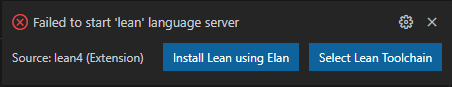
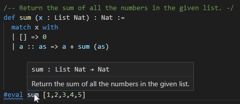
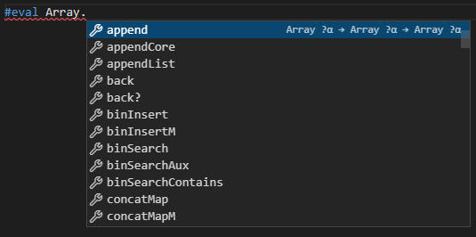
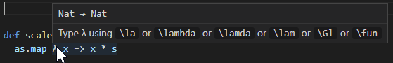
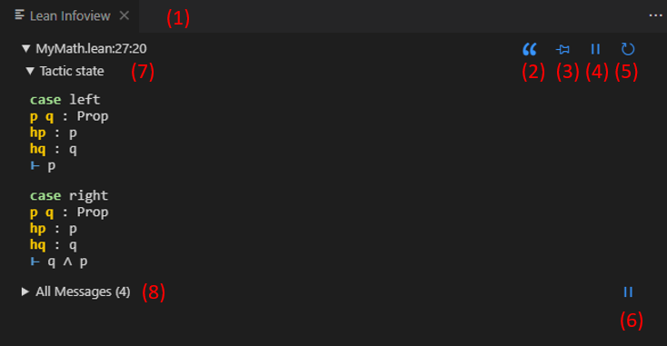
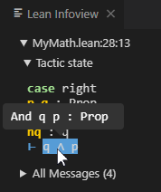
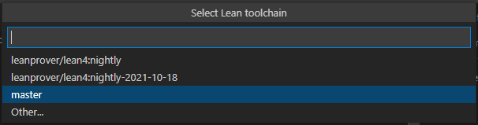
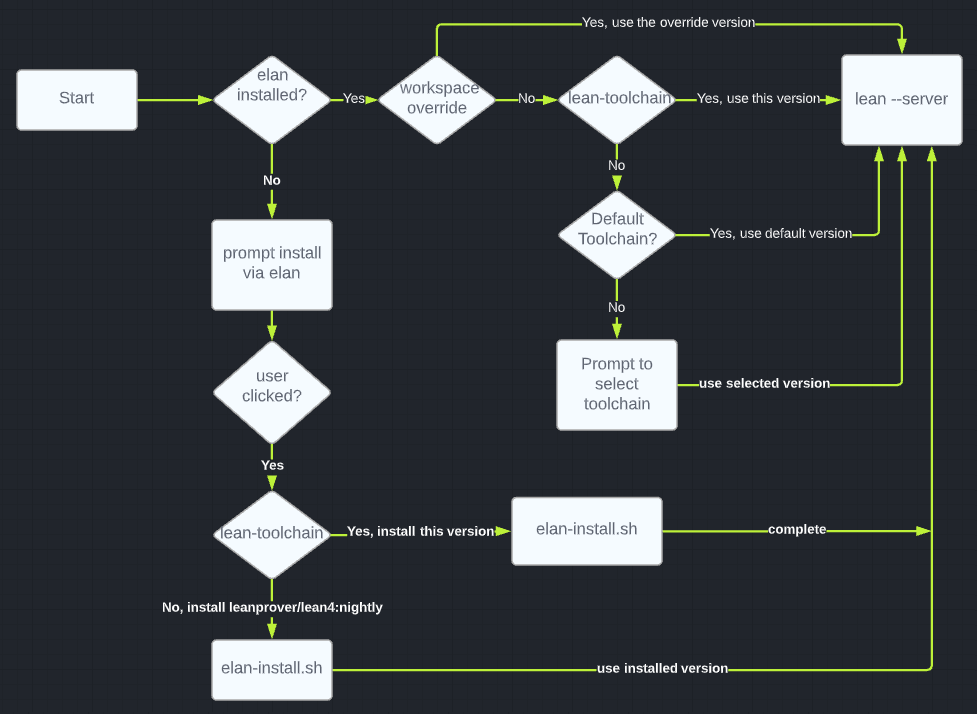

# Lean 4 VSCode Extension
This extension provides VSCode editor support for the Lean 4 programming language. It uses the
all new [Language Server](https://docs.microsoft.com/en-us/visualstudio/extensibility/language-server-protocol)
implemented in Lean.

## Installing the extension and Lean 4
1. Install the extension from the [marketplace](https://marketplace.visualstudio.com/items?itemName=leanprover.lean4).
1. Create a new folder called `foo` and add a file named `hello.lean`
containing the following:

    ```lean
    import Lake
    #eval Lake.leanVersionString
    ```
1. Open this folder in VS Code using `File/Open Folder`.
1. Open your file `hello.lean`.
1. If `Lean` is not yet installed on your system you will see a prompt like this:

    

1. Click the `Install Lean using Elan` option and enter any default options that appear in the terminal window.
1. After this succeeds the correct version of Lean will be installed by `elan`
and you should see something like this in the `Lean: Editor` output panel:
    ```
    info: downloading component 'lean'
    info: installing component 'lean'
    Lean (version 4.0.0-nightly-2021-10-18, commit e843fb7ca5b5, Release)
    ```

See [Complete Setup](#complete_setup) for more information
on how the lean version is determined for your VS Code workspace.

This version of the VS Code extension only works on Lean 4 source files and not
Lean 3.  There is a separate VS Code extension for Lean 3.  You can have both extensions installed at the same time, they can live side by side.

## Lake integration

Note that once the Lean toolchain is installed you can also turn your folder into a [Lake](https://github.com/leanprover/lake/blob/master/README.md) project.  Lake is a build system
for Lean projects.  The VS code extension will honor the Lean version specified in your `lean-toolchain` file.

Open a VS Code Terminal window in your `foo` folder and type the following:

```
lake init foo
lake build
```
This will add some package definition files to your project along with a `Main.lean` entry point and build an executable
program.  You can run the program `./build/bin/foo` and you will see the expected output:
```
Hello, world!
```

## Features

The extension supports the following features.
For basic VS Code editor features, see the [VS Code User Interface docs](https://code.visualstudio.com/docs/getstarted/userinterface).

The extension provides:
- A set of handy `Lean4:` commands available with <kbd>Ctrl</kbd>+<kbd>Shift</kbd>+<kbd>P</kbd>
- Side-by-side compatibility with the [Lean 3 VSCode extension](https://github.com/leanprover/vscode-lean)
- Nice integration with the Lean [Language Server](https://docs.microsoft.com/en-us/visualstudio/extensibility/language-server-protocol) as shown below.
- An Infoview panel showing interactive information about your Lean programs.

## Lean language server features

- Automatic installation of Lean using [elan](https://github.com/leanprover/elan).
- Incremental compilation and checking via the Lean server (*)
- Type information & documentation on hover
- Error messages and diagnostics
- Syntax highlighting with basic Lean 4 syntax rules
- Semantic highlighting
- Hover shows documentation, types:

  

- Auto-completion drop downs based on context and type via the Lean Server.
For example, if you type "." after `Array` you will get:

  

- An Infoview displaying useful information about your current Lean program.
- Goto definition (F12) will work if the Lean source code is available.  A standard elan install of
  the Lean toolchain provides Lean source code for all the Lean standard library, so you can go to
  the definition of any standard library symbol which is very useful when you want to learn more
  about how the library works. Note also that currently goto definition does not work if the cursor
  is at the very end of a symbol like `Array.append|`.  Move the cursor one character to the left
  `Array.appen|d` and it will work.  See [open issue #767](https://github.com/leanprover/lean4/issues/767).

- [Breadcrumbs](https://code.visualstudio.com/Docs/editor/editingevolved#_breadcrumbs)

(*) Incremental updates do not yet work automatically across files, so after changing and rebuilding the dependency of a
Lean 4 file, the language server needs to be manually informed that it should re-elaborate the full file, including the
imports. This can be done using the `Lean 4: Refresh File Dependencies` command, which can be activated via <kbd>Ctrl</kbd>+<kbd>Shift</kbd>+<kbd>X</kbd>.

## Lean editing features

- Support for completing abbreviations starting with a backslash (\\).
For example you type `\alpha` and the editor automatically replaces that with the nice Unicode character `α`.
You can disable this feature using the `lean4.input.enabled` setting, see below.
- When you hover the mouse over a letter that has one or more abbreviations you will see a tooltip like this:
    
- Auto-completing of brackets like `()`, `{}`, `[]`, ` `, `⦃ ⦄`, `⟮ ⟯`, `⦃ ⦄` and block comments `/- ... -/`.


## Infoview panel

The Infoview panel is essential to working interactively with Lean. It shows:
- **Tactic state widgets**, with context information (hypotheses, goals) at each point in a proof / definition,
- **Expected type** widgets display the context for subterms.
- **Types** of sub-terms in the context can be inspected interactively using mouse hover.
- **All Messages** widget, which shows all info, warning, and error messages from the Lean server for the current file.

Suppose you have the following theorem:

```lean
theorem test (p q : Prop) (hp : p) (hq : q) : p ∧ q ∧ p :=
  by apply And.intro
     exact hp
     apply And.intro
     exact hq
     exact hp
```

and you place the cursor at the end of the line `by apply And.intro` the Infoview will display the following information:



(1). The Infoview will activate automatically when a Lean file is opened, but you can also reopen it any time using the icon in the top right of the text editor window or the <kbd>Ctrl</kbd>+<kbd>Shift</kbd>+<kbd>P</kbd> `Lean 4: Infoview: Display Goal` command or the key that is bound to the command, which is <kbd>Ctrl</kbd>+<kbd>Shift</kbd>+<kbd>Enter</kbd> by default.
You can also disable auto-opening behavior using the setting `lean4.infoViewAutoOpen` described below.

(2) through (6):

  | Symbol | Description |
  |--------|-------------|
  |  | Copy the contents of the widget to a comment in the active text editor. |
  |  | Split off a "pinned" tactic state widget, which tracks the tactic state at a fixed position, even if you move your cursor away.  When pinned you will see the unpin and reveal file location icons appear. |
  |  | Remove a pinned widget from the Infoview. |
  |  | Move the cursor in the editor to the pinned location in the file. |
  |  | Prevent the tactic state widget from updating when the file is edited. When paused you will see the following addition icons show up.
  |  | Once paused you can then click this icon to resume updates. |
  |  | Refresh the tactic state of the pinned widget. |
  |  | Reverse the order of the lists under Tactic State.  |

(7). Types in the context can be examined in the tactic state widget using mouse hover:

  

(8). The "All Messages" widget can be expanded by clicking on it (or hitting the keybind for `lean4.displayList`, which is <kbd>Ctrl</kbd>+<kbd>Shift</kbd>+<kbd>Alt</kbd> by default


## Extension Settings

This extension contributes the following settings (for a complete list, open the VS Code Settings and type `Lean4` in the search box):

### Server settings

* `lean4.toolchainPath`: specifies the location  of the Lean toolchain to be used when starting the Lean language server. Most users (i.e. those using `elan`) should not ever need to change this. If you are bundling Lean and `vscode-lean` with [Portable mode VS Code](https://code.visualstudio.com/docs/editor/portable), you might find it useful to specify a relative path to Lean. This can be done by starting this setting string with `%extensionPath%`; the extension will replace this with the absolute path of the extension folder. For example, with the default directory setup in Portable mode, `%extensionPath%/../../../lean` will point to `lean` in the same folder as the VS Code executable / application.

* `lean4.serverEnv`: specifies any Environment variables to add to the Lean 4 language server environment.  Note that when opening a [remote folder](https://code.visualstudio.com/docs/remote/ssh) using VS Code the Lean 4 language server will be running on that remote machine.

* `lean4.serverEnvPaths`: specifies any additional paths to add to the Lean 4 language server environment PATH variable.

* `lean4.serverArgs`: specifies any additional arguments to pass on the `lean --server` command line.

* `lean4.serverLogging.enabled`: specifies whether to do additional logging of
commands sent to the Lean 4 language server. The default is `false`.

* `lean4.serverLogging.path`: if `serverLogging.enabled` is true this provides the
name of the relative path to the store the logs.

### Input / editing settings

* `lean4.input.enabled`: enables abbreviation input completion mode.  For example, it allows  you to type `\alpha` and have that be replaced with the greek letter (α).

* `lean4.input.eagerReplacementEnabled`: enables/disables eager replacement as soon as the abbreviation is unique (`true` by default)

* `lean4.input.leader`: character to type to trigger abbreviation input completion input mode (`\` by default).

* `lean4.input.languages`: specifies which VS Code programming languages the abbreviation input completion will be used in.  The default is [`lean4`, `lean`].

* `lean4.input.customTranslations`: add additional input Unicode translations. Example: `{"foo": "☺"}` will correct `\foo` to `☺` (assuming the `lean.input.leader` has its default value `\`).

* `lean4.typesInCompletionList`: controls whether the types of all items in the list of completions are displayed. By default, only the type of the highlighted item is shown.

### Infoview settings

* `lean4.infoViewAutoOpen`: controls whether the Infoview is automatically displayed when the Lean extension is activated for the first time in a given VS Code workspace(`true` by default).  If you manually close the Infoview it will stay closed for that workspace until.  You can then open it again using the <kbd>Ctrl</kbd>+<kbd>Shift</kbd>+<kbd>P</kbd> `Lean 4: Infoview: Display Goal` command.

* `lean4.infoViewAutoOpenShowGoal`: auto open shows goal and messages for the current line (instead of all messages for the whole file).  In this mode the Infoview updates often every time you move the cursor to a different position so it can show context sensitive information.  Default is `true`.

* `lean4.infoViewTacticStateFilters`: An array of objects containing regular expression strings that can be used to filter (positively or negatively) the plain text tactic state in the Infoview. Set to an empty array `[]` to hide the filter select dropdown. Each object must contain the following keys:
  - `regex` is a properly-escaped regex string,
  - `match` is a boolean, where `true` (`false`) means blocks in the tactic state matching `regex` will be included (excluded) in the Infoview,
  - `flags` are additional flags passed to the [JavaScript RegExp constructor](https://developer.mozilla.org/en-US/docs/Web/JavaScript/Reference/Global_Objects/RegExp).
  - The `name` key is optional and may contain a string that is displayed in the dropdown instead of the full regex details.

* `lean4.infoViewFilterIndex`: Index of the filter applied to the tactic state (in the array infoViewTacticStateFilters). An index of -1 means no filter is applied (which is the default for this setting).

* `lean4.infoViewAllErrorsOnLine`: show all errors on the current line, instead of just the ones on the right of the cursor, default `true`.

* `lean4.elaborationDelay`: Time (in milliseconds) which must pass since latest edit until elaboration begins. Lower values may make editing feel faster at the cost of higher CPU usage.  The default is 200.


## Extension commands

This extension also contributes the following commands, which can be bound to keys if desired using the [VS Code keyboard bindings](https://code.visualstudio.com/docs/getstarted/keybindings).

The format below is: "`lean4.commandName` (command name): description", where `lean.commandName` represents the name used in `settings.json` and "command name" is the name found in the [command palette](https://code.visualstudio.com/docs/getstarted/userinterface#_command-palette) (accessed by hitting <kbd>Ctrl</kbd>+<kbd>Shift</kbd>+<kbd>P</kbd>).

### Server commands

* `lean4.restartServer` (Lean 4: Restart Server): restart the Lean 4 Language Server. Useful if the server crashes or if you built new `.olean` files in your workspace.

* `lean4.refreshFileDependencies` (Lean 4: Refresh File Dependencies): This command is a work around for the fact that full incremental updates do not yet work automatically across files, so after changing and rebuilding the dependency of a
Lean 4 file, the language server needs to be manually informed that it should re-elaborate the full file, including the
imports. This command has a default keyboard binding of <kbd>Ctrl</kbd>+<kbd>Shift</kbd>+<kbd>X</kbd>.

* `lean4.selectToolchain` (Lean 4: Select Lean Toolchain) Select version of the Lean toolchain to use for the current workspace.  This shows the list of available toolchains returned from `elan toolchain list` and allows you to easily switch. The Lean 4 language server will automatically be restarted using the selected toolchain.  This command also provides a choice labelled `Other...` where you can enter the full path to a Lean 4 toolchain to use instead.  This choice is remembered in your [Workspace Settings](https://code.visualstudio.com/docs/getstarted/settings) and you can reset any custom choice by selecting `Reset workspace override...` from the list (if it is shown).

    

    You can test the latest [Lean 4 master branch](https://github.com/leanprover/lean4) with this VS Code extension.  First you build Lean, then run the following commands:
    ```
    cd <lean4-repo>
    elan toolchain link master ./build/release/stage1
    ```
    Now the `Lean4: Select Toolchain` will show `master` as one of the toolchains you can select.
    You will then see a prompt to restart the Lean Language Server and if you click `Restart Lean`, the
    server will be restarted automatically using the your brand new locally built version of Lean.
    This is useful if you are adding features to Lean 4 that you want to test in the VS Code
    extension before an official Lean4 nightly build is published.

    Alternatively, you can use the `Other...` option and just provide the full path containing
    your build output at `.../build/release/stage1/`.


### Editing commands

* `lean4.input.convert` (Lean 4: Input: Convert Current Abbreviation): converts the current abbreviation (bound to <kbd>tab</kbd> by default)

### Infoview commands

* `lean4.displayGoal` (Lean 4: Infoview: Display Goal): open the Infoview panel (bound to <kbd>Ctrl</kbd>+<kbd>Shift</kbd>+<kbd>Enter</kbd> by default)

* `lean4.displayList` (Lean 4: Infoview: Toggle "All Messages"): toggles the "All messages" widget in the Infoview (bound to <kbd>ctrl</kbd>+<kbd>alt</kbd>+<kbd>shift</kbd>+<kbd>enter</kbd> by default)

* `lean4.infoView.copyToComment` (Lean 4: Infoview: Copy Contents to Comment"): if there is a valid value in the Infoview marked with the  icon that can be copied to a comment, this command invokes that action in the editor.

* `lean4.infoView.toggleStickyPosition` (Lean 4: Infoview: Toggle Pin): enable / disable "sticky" mode. On enable, a tactic state widget will be created and pinned to this position, reporting the goal from this point even as the cursor moves and edits are made to the file. On disable the pinned widget will be removed. (same as clicking on the  or  icon on the tactic state widget closest to the cursor.)

* `lean4.infoView.toggleUpdating` (Lean 4: Infoview: Toggle Updating): pause / continue live updates of the main (unpinned) tactic state widget (same as clicking on the  or  icon on the main tactic state widget.)

### Documentation commands

* `lean4.docView.open` (Lean 4: Open Documentation View): Open documentation found in local 'html' folder in a separate web view panel.

* `lean4.docView.showAllAbbreviations` (Lean 4: Show all abbreviations): Show help page containing all abbreviations and the Unicode characters they map to.  This makes it easy to then search for the abbreviation for a given symbol you have in mind using <kbd>Ctrl</kbd>+<kbd>F</kbd>.

## Complete Setup

The complete flow chart for determining how elan and lean are installed is shown below:



The `start` state is when you have opened a folder in VS Code and opened a .lean file to activate this extension.

If the extension finds that elan is not in your path and is not installed in the default location then it will prompt
you to install lean via elan.  If the folder contains a `lean-toolchain` version it will install that version
otherwise it will install `leanprover/lean4:nightly`.

If elan is installed and there is a workspace override in place created by the `Select Toolchain`
command then this version takes precedence until you remove that override.

Otherwise, if there is a `lean-toolchain` (or `leanpkg.toml`) in the workspace folder or in a parent
folder then it will use the version specified in the specified version.

Otherwise, if `elan toolchain list` shows there is a `(default)` toolchain it will use that version.

Otherwise, it will prompt you to select a toolchain using the `Select Toolchain` command.  If the
elan toolchain list is empty it will add `leanprover/lean4:nightly` to the list so that there is
always something to select.

Then with the selected version it runs `lean --version` to check if that version is installed yet.
If this version is not yet installed `lean --version` will install it.

In the case of a workspace override the `+version` command line option is used on `lean --version`
and `lean --server` to ensure that the overridden version is used.

## For VSCode extension developers

See [Development](docs/dev.md).
