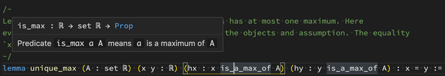
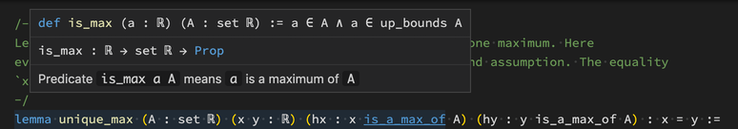
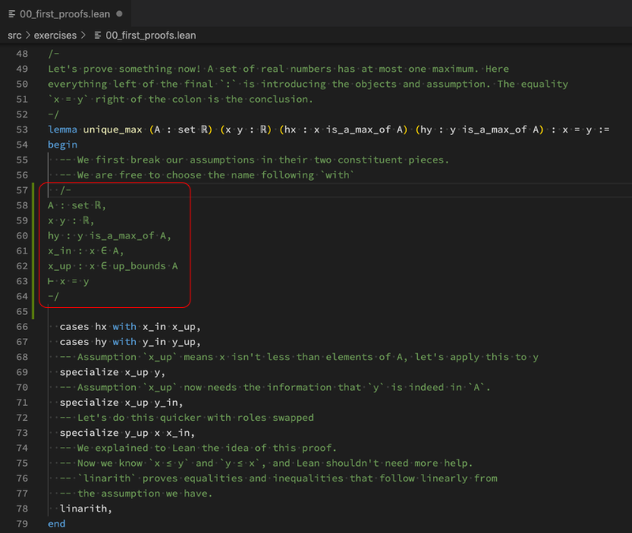
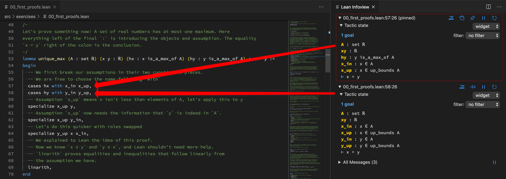
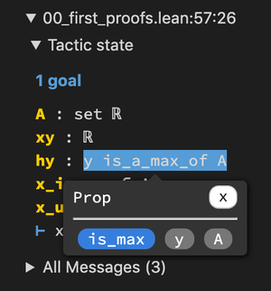
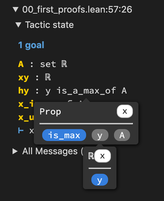
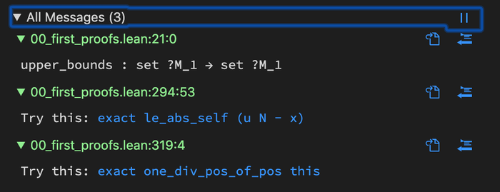
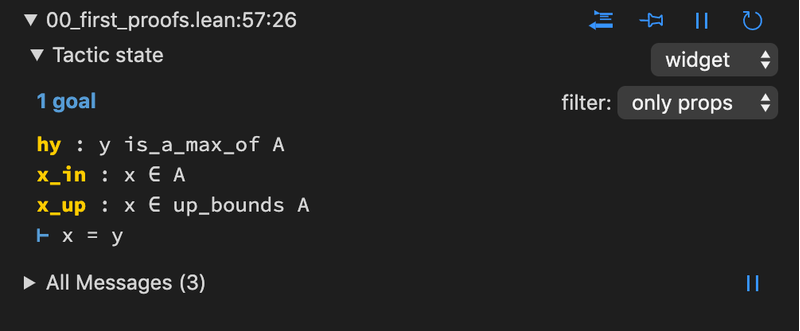

# Lean for VS Code

This extension adds support for [Lean](https://github.com/leanprover/lean).

## Features

We currently support a variety of features. For basic VS Code editor features, see the [VS Code User Interface docs](https://code.visualstudio.com/docs/getstarted/userinterface).

### Lean language server support

* Automatic installation of Lean via [elan](https://github.com/leanprover/elan)
* Incremental compilation and checking via the Lean server
* Hover shows documentation, types, and Unicode input help:
  * Here's an example from the [Lean tutorials project](https://github.com/leanprover-community/tutorials):

    
  * Holding down <kbd>ctrl</kbd> will display the declaration as well:

    
* Auto-completion based on context and type via the Lean server
* Error messages / diagnostics
* Batch file execution
* Tasks for `leanpkg` (<kbd>ctrl</kbd>+<kbd>shift</kbd>+<kbd>p</kbd> and select "Tasks: Configure Task")
* Search for declarations in open files (<kbd>ctrl</kbd>+<kbd>t</kbd> or <kbd>ctrl</kbd>+<kbd>p</kbd> `#`)
* Region of interest checking (i.e. control how much of the project is checked automatically by Lean)
<!--- TODO(Bryan): fix this or remove it
* Type of the term under the cursor can be displayed in the status bar --->

### Lean editing features

* Customizable Unicode input support (e.g. type `\la`+<kbd>tab</kbd> to input `λ`)
* Fill in `{! !}` holes (also `_` holes in Lean 3.16.0c and later) with the [code actions](https://code.visualstudio.com/docs/editor/refactoring#_code-actions-quick-fixes-and-refactorings) menu (<kbd>ctrl</kbd>+<kbd>.</kbd>)
* Tactic suggestions (tactics which suggest edits with a "Try this:" message) can be applied either with a keyboard shortcut (<kbd>alt</kbd>+<kbd>v</kbd>), by clicking on the info view message, or via code actions (<kbd>ctrl</kbd>+<kbd>.</kbd>)

### Info view panel

The info view panel is essential to working interactively with Lean. It shows:
- tactic state widgets, with context information (hypotheses, goals) at each point in a proof / definition,
  - (in Lean 3.15.0c and newer) "expected type" widgets display the context for subterms.
  - (in Lean 3.15.0c and newer) the types of subterms in the context can be inspected interactively.
- the "All Messages" widget, which shows all info, warning, and error messages from the Lean server, and
- (in Lean 3.15.0c and newer) other [custom widgets](https://leanprover-community.github.io/mathlib_docs/core/init/meta/widget/basic.html) can be rendered in the info view.

(1) - (9) below refer to the labels in the screenshot above.

The icons labeled (2) - (5) and (8) - (9) appear at the top of each tactic state widget.

1. The info view will activate automatically when a Lean file is opened, but you can also click  at the top right of the editor window or hit the keybind for the `lean.displayGoal` (<kbd>ctrl</kbd>+<kbd>shift</kbd>+<kbd>enter</kbd> by default) to reopen it.

2. Copy-to-comment: click  to copy the contents of the widget to a comment in the editor:

   

3. Pin / unpin: click  to split off a "pinned" tactic state widget, which tracks the tactic state at a fixed position, even if you move your cursor away:

   

   Some new icons appear:
   * Reveal file location: clicking  will move the cursor in the editor to the pinned location in the file.
   * Unpin: clicking  will remove the pinned widget from the info view.

4. Pause / continue: clicking  will prevent the tactic state widget from updating when the file is edited. Click  to resume updates.

5. Update: clicking  will refresh the tactic state of the pinned widget.

6. (Lean 3.15.0c and newer) Types in the context can be examined in the tactic state widget by clicking on the subterms:

   

   The subterms that appear in the popup are buttons; click on them to inspect their types:

   

7. The "All Messages" widget can be expanded by clicking on it (or hitting the keybind for `lean.displayList`, <kbd>ctrl</kbd>+<kbd>alt</kbd>+<kbd>shift</kbd>+<kbd>enter</kbd> by default)

   

8. Widget / plain text selection: For Lean versions older than Lean 3.15.0c, the tactic state is displayed as a non-interactive string. For newer versions of Lean, the widget mode (with features described in (6)) is used by default. This dropdown menu allows selecting between the two.

9. Tactic state filter: the hypotheses in the tactic state can be filtered, with options on whether the tactic state is being displayed as a widget or in plain text (see (8)).
   * In widget mode, the allowed filters are built into Lean. Currently you can choose to filter out instances or data, by selecting "no instances" or "only props", respectively.

     

   * In plain text mode, you can add or edit the regex-based filters by using the option `lean.infoViewTacticStateFilters`. See the description below. The two filters included by default are:
     * "hide `/^_/`", which filters out all hypotheses which begin with an underscore `_` (typically, instances) and
     * "goals only", which hides all hypotheses and only displays the goal lines.

### Documentation view

The book ["Theorem Proving in Lean"](https://leanprover.github.io/theorem_proving_in_lean) can be read by hitting <kbd>ctrl</kbd>+<kbd>shift</kbd>+<kbd>p</kbd> and searching for "Lean: Open Documentation View".

Any Lean project with an `html/` folder can be displayed in this panel. For example, try out the book [Mathematics in Lean](https://leanprover-community.github.io/mathematics_in_lean).

## Requirements

This extension requires an installation of [Lean](https://leanprover.github.io). As of version 0.12.1, the extension can install Lean for you using [elan](https://github.com/Kha/elan). However, we highly recommend following the instructions at the [mathlib installation docs](https://leanprover-community.github.io/get_started.html).

On Windows, if you installed Lean using MSYS2, you need to add both `C:\msys64\mingw64\bin` (or wherever you installed MSYS2) and `C:\projects\lean\bin` (or wherever you installed Lean) to the system `PATH` environment variable. To do this, press <kbd>Win</kbd>+<kbd>Pause</kbd> > go to Advanced System Settings > go to Environment variables. Under system variables (not user variables) find the `Path` variable, and add these two folders.

## Extension Settings

This extension contributes the following settings (for a complete list, open the VS Code Settings and scroll to "Lean configuration"):

### Server settings

* `lean.executablePath`: controls which Lean executable is used when starting the server. Most users (i.e. those using `elan`) should not ever need to change this. If you are bundling Lean and `vscode-lean` with [Portable mode VS Code](https://code.visualstudio.com/docs/editor/portable), you might find it useful to specify a relative path to Lean. This can be done by starting this setting string with `%extensionPath%`; the extension will replace this with the absolute path of the extension folder. For example, with the default directory setup in Portable mode, `%extensionPath%/../../../lean` will point to `lean` in the same folder as the VS Code executable / application.

* `lean.leanpkgPath`: controls which leanpkg executable is used for `leanpkg` task integration. The `%extensionPath%` token can be used here as well. As above, if you are using `elan`, this should never need to be changed.

* `lean.extraOptions`: an array of additional command-line options to pass to `lean` (e.g. `--old` in Lean 3.10.0c or later, which allows Lean to use out-of-date `.olean`s.)

* `lean.timeLimit`: controls the `-T` flag passed to the Lean executable

* `lean.memoryLimit`: controls the `-M` flag passed to the Lean executable

* `lean.roiModeDefault`: controls the default region of interest, the options are:
  - `nothing`: check nothing
  - `visible`: check only visible files
  - `linesAndAbove`: check visible lines and above
  - `open`: check all open files
  - `project`: check the entire project's files

### Input / editing settings

* `lean.input.eagerReplacementEnabled`: enables/disables eager replacement as soon as the abbreviation is unique (`true` by default)

* `lean.input.leader`: character to type to trigger Unicode input mode (`\` by default)

* `lean.input.languages`: allows the Unicode input functionality to be used in other languages

* `lean.input.customTranslations`: add additional input Unicode translations. Example: `{"foo": "☺"}` will correct `\foo` to `☺` (assuming the `lean.input.leader` has its default value `\`).

* `lean.typesInCompletionList`: controls whether the types of all items in the list of completions are displayed. By default, only the type of the highlighted item is shown.

<!-- TODO(Bryan): fix or remove
* `lean.typeInStatusBar`: controls whether the type of the term under the cursor is displayed as a status bar item (`true` by default). -->

### Info view settings

* `lean.infoViewAutoOpen`: controls whether the info view is automatically displayed when the Lean extension is activated (`true` by default).

* `lean.infoViewTacticStateFilters`: An array of objects containing regular expression strings that can be used to filter (positively or negatively) the plain text tactic state in the info view. Set to an empty array `[]` to hide the filter select dropdown. Each object must contain the following keys:
  - `regex` is a properly-escaped regex string,
  - `match` is a boolean, where `true` (`false`) means blocks in the tactic state matching `regex` will be included (excluded) in the info view,
  - `flags` are additional flags passed to the [JavaScript RegExp constructor](https://developer.mozilla.org/en-US/docs/Web/JavaScript/Reference/Global_Objects/RegExp).
  - The `name` key is optional and may contain a string that is displayed in the dropdown instead of the full regex details.

## Extension commands

This extension also contributes the following commands, which can be bound to keys if desired.

The format below is: "`lean.commandName` (command name): description", where `lean.commandName` represents the name used in `settings.json` and "command name" is the name found in the [command palette](https://code.visualstudio.com/docs/getstarted/userinterface#_command-palette) (accessed by hitting <kbd>ctrl</kbd>+<kbd>shift</kbd>+<kbd>p</kbd>).

### Server commands

* `lean.restartServer` (Lean: Restart): restart the Language Server. Useful if the server crashes or if you fetched new `.olean` files using [leanproject](https://github.com/leanprover-community/mathlib-tools).

* `lean.roiMode.select` (Lean: Select Region-of-interest): select the region of interest (files to be checked by the Lean server).

  

    
The choices can also be made directly:

    * `lean.roiMode.nothing` (Lean: Check Nothing): disable automatic checking of Lean code.

    * `lean.roiMode.visibleFiles` (Lean: Check Visible Files): automatically check all files that are visible.

    * `lean.roiMode.linesAndAbove` (Lean: Check visible lines and above): automatically check all visible lines and lines above them.

    * `lean.roiMode.openFiles` (Lean: Check Open Files): automatically check all opened files.

    * `lean.roiMode.projectFiles` (Lean: Check Project Files): automatically check all files in the workspace.

  

* `lean.batchExecute` (Lean: Batch Execute File): execute the current file using Lean (bound to <kbd>ctrl</kbd>+<kbd>shift</kbd>+<kbd>r</kbd> by default)

### Editing commands

* `lean.input.convert` (Lean: Input: Convert Current Abbreviation): converts the current Unicode abbreviation (bound to <kbd>tab</kbd> by default)

* `lean.pasteTacticSuggestion`: if any tactic suggestions (i.e. tactics which return a "Try this:" in their output) are active for the code under the cursor, apply the first suggested edit. (bound to <kbd>alt</kbd>+<kbd>v</kbd> by defaullt)

### Info view commands

* `lean.displayGoal` (Lean: Info View: Display Goal): open the info view panel (bound to <kbd>ctrl</kbd>+<kbd>shift</kbd>+<kbd>enter</kbd> by default)

* `lean.displayList` (Lean: Info View: Toggle "All Messages"): toggles the "All messages" widget in the info view (bound to <kbd>ctrl</kbd>+<kbd>alt</kbd>+<kbd>shift</kbd>+<kbd>enter</kbd> by default)

* `lean.infoView.copyToComment` (Lean: Info View: Copy Contents to Comment): copy the contents of the currently active tactic state widget into a new comment on the previous line (same as clicking on the  icon)

* `lean.infoView.toggleStickyPosition` (Lean: Info View: Toggle Pin): enable / disable "sticky" mode. On enable, a tactic state widget will be created and pinned to this position, reporting the goal from this point even as the cursor moves and edits are made to the file. On disable the pinned widget will be removed. (same as clicking on the  or  icon on the tactic state widget closest to the cursor.)

* `lean.infoView.toggleUpdating` (Lean: Info View: Toggle Updating): pause / continue live updates of the main (unpinned) tactic state widget (same as clicking on the  or  icon on the main tactic state widget.)

### Doc view

* `lean.openDocView` (Lean: Open Documentation View): open documentation panel. See [above](#documentation-view).

## Other potentially helpful settings

* Fonts with good Unicode support: `"editor.fontFamily": "Source Code Pro Medium, DejaVu Sans Mono"`. Note that for this configuration to work properly, both fonts must be specified in this order (so that characters that are not available in [Source Code Pro](https://github.com/adobe-fonts/source-code-pro) are rendered using [DejaVu Sans Mono](https://dejavu-fonts.github.io/)).

* By default, VS Code will complete `then` to `has_bind.and_then` when you press enter.  To disable this behavior, set `"editor.acceptSuggestionOnEnter": false`.

* If you like colored brackets, try out [Bracket Pair Colorizer 2](https://marketplace.visualstudio.com/items?itemName=CoenraadS.bracket-pair-colorizer-2).

## Development

* Install `npm` (and for Ubuntu 17.04 `nodejs-legacy`)
* Install `code` from http://code.visualstudio.com
* Run `git clone https://github.com/leanprover/vscode-lean`
* Run `npm install` in the `vscode-lean` directory
* Install the [ESLint extension for vscode](https://marketplace.visualstudio.com/items?itemName=dbaeumer.vscode-eslint)
* Install the [Webpack Problem Matcher extension for vscode](https://marketplace.visualstudio.com/items?itemName=eamodio.tsl-problem-matcher)
* Open the `vscode-lean` directory in VS Code and start developing (<kbd>F5</kbd> starts the debugger)

## Release Notes

### 0.16.21
* Improved Lean input mode.  The `lean.input.convertWithNewline` command has been removed.  Abbreviations are now converted eagerly; this can be disabled with the `lean.input.eagerReplacementEnabled` option.
* Both the Lean 3 and Lean 4 extension can be installed at the same time now.

### 0.16.0
* Info view redesign: tactic state and messages are now combined in one window. Multiple positions can be pinned. Types in the tactic state widget can be expanded by clicking on them (when using Lean 3.15.0c and newer)!

### 0.15.13
* "sticky" mode for the infoview position

### 0.15.0
* Command to apply tactic suggestions such as from `library_search` (using <kbd>alt</kbd>+<kbd>v</kbd> or clicking "Try this:" in the info view)

### 0.14.0
* Show type of term under cursor in status bar

### 0.13.3
* Info view opens automatically

### 0.13.1
* Dropdown to filter tactic states

### 0.13.0
* Dropped support for Lean versions older than 3.1.0.

### 0.12.1
* Automated `elan` installation

### 0.11.2
* Tactic state highlighting

### 0.11
* Support for `visibleRanges` API in vscode.  Per default, only the currently visible lines and the rest of the file above are checked.

### 0.10.1
* Updated syntax highlighting.

### 0.10.0
* New configuration option for extra command-line arguments. (`lean.extraOptions`)
* Integration with `leanpkg`.

### 0.9.0
* Extremely improved info view (<kbd>ctrl</kbd>+<kbd>shift</kbd>+<kbd>enter</kbd>)
* Only show commands acting on Lean files when a Lean file is open in the current editor
* Hole support

### 0.8.0
* Info view showing the current goal and error messages.
* Search command (<kbd>ctrl</kbd>+<kbd>p</kbd> `#`)
* Improved Unicode input.

### 0.7.2
* New input mode for Unicode symbols.
* Internally uses new [client library](https://github.com/leanprover/lean-client-js) to interact with the Lean server.

### 0.7.1
* Fixes issue with highlighting commands beginning with `#`.

### 0.7.0
* Support for controlling the "region of interest", i.e. which files
  are considered by the Lean server for checking and recompilation.
* Miscellaneous improvements to the grammar, and syntax highlighting
* Initial support for recording Lean server errors, and an option
  for displaying them upon crash.
* Support for more bracket pairs including many Unicode options.
* Properly set working directory when executing in batch mode.
* Configuration for controlling default region of interest.

### 0.6.6

* Use `semver` for detecting and comparing versions.
* Fix issue where diagnostics were not cleared on
  server restart.

### 0.6.5

Add support for detecting Lean server versions.

### 0.6.4

Add support for time and memory limits.

### 0.6.2

Consider angle brackets and parenthesis when completing Unicode symbols.

### 0.6.0

Bug fixes, stability, and a handful of feature improvements

### 0.4.0

Implement many features implemented by the EMACS mode. We now support:

- Hovering over names for type information
- Go-to-definition & peeking for constants
- Goal support, with the ability to display the
  goal at the current position.
- Basic auto-completion support
- Diagnostics support, displaying errors, information
   & warnings.

### 0.3.0

Add basic integration with the Lean server.

### 0.1.0

Initial release of the package.

-----------------------------------------------------------------------------------------------------------

## Contact

Please report issues on [Github](https://github.com/leanprover/vscode-lean). Questions can also be asked on the [Lean prover community Zulip chat](https://leanprover.zulipchat.com).
