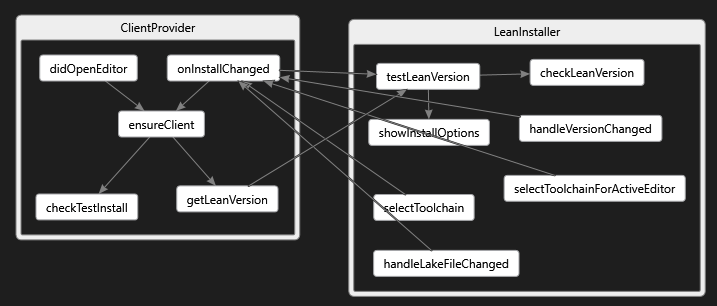
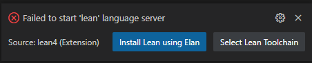

## Bootstrapping

Considerable effort has gone into ensuring the Lean extension bootstraps the Lean install
smoothly.

When a Lean4 document is opened the `didOpenEditor` event fires on the
`ClientProvider`.  If this finds it to be a Lean4 source file it calls `ensureClient` to make sure we have a running `LeanClient` for this
document.

In the bootstrapping case there is no elan or lean compiler installed
yet and in that case `getLeanVersion` calls `testLeanVersion` on the
`LeanInstaller` and if there is no elan or lean version it calls
`showInstallOptions` which pops up the message:

If the user clicks `Install Lean using Elan` then this will happen
and elan will be installed in the default location and a nightly build
of Lean will also be installed.

When the install finishes an `installChanged` event is raised which is
received by the ClientProvider which then calls `ensureClient` again
to make sure the Lean server gets up and running.

Now when the tests are running we don't want a user prompt, so in that
case the code path goes to `checkTestInstall`, which blocks until the
install is complete and then the original `ensureClient` call continues
with a fully installed Lean.
