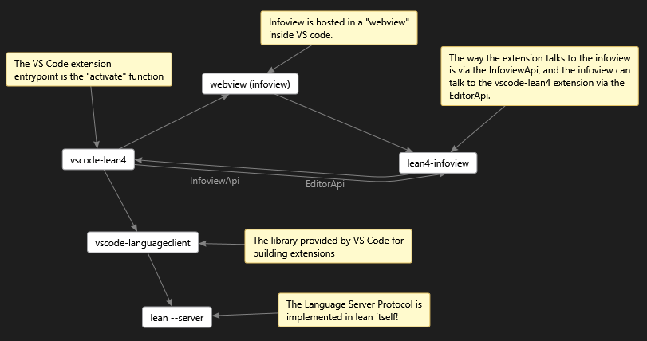

# Development

This page is designed for software developers who are helping to develop this Lean VS Code exension.

The repository contains NPM packages implementing editor integration for the Lean 4 programming language. The VS Code
extension proper is in [`vscode-lean4`](vscode-lean4/), while [`lean4-infoview`](lean4-infoview/) implements the
information display. The API glue code between them is in [`lean4-infoview-api`](lean4-infoview-api/). We build
the packages in tandem using Lerna.

### Building
- Make sure you have an up to date installation of `npm` and `node.js`.  For example `npm` version 8.1.3 and `node.js` version v16.13.0.
- Run `npm install` in this folder. This installs the Lerna package manager.
- Run `npx lerna bootstrap`. This sets up the project's dependencies.
- Run `npx lerna run build`. This compiles the extension (which is necessary for go-to-definition in VS Code).

### Testing
- Make sure you have executed the above build steps
- Run `npm run test`
- See [test readme](vscode-lean4/test/readme.md) for more information.

### Debugging
- Open VS Code on this folder.
- Press <kbd>Ctrl</kbd>+<kbd>Shift</kbd>+<kbd>B</kbd> to compile the extension. This step is needed for a working development setup.
- Press F5 to launch the extension in the VS Code debugger, (the correct launch.json configuration is already checked into this repo.)

To debug the tests use the launch configuration named `Extension Tests - SuiteName`.

**Note:** if breakpoints are not working, try changing one line of code in `function activate` in `extension.ts`, even
adding a newline seems to work, then press F5.

## Packaging

To publish the extension on the VS Code marketplace you
should run the `./release.sh` script.

See [publishing extensions](https://code.visualstudio.com/api/working-with-extensions/publishing-extension)
for more information.

You can build a local .vsix for testing using `npm run package` in the `vscode-lean4/` subdirectory.

This gives you a .vsix which you can install using the VS Code
command `Extensions: Install from VSIX...`.

## Troubleshooting

**[!] SyntaxError: Cannot use import statement outside a module**

On Windows the build can fail if the path in your Terminal window has the wrong "case" on the drive letter.
For example, if your terminal was started in `d:\git\leanprover\vscode-lean4` and you get this error then
try and start your terminal using an upper case driver letter like this: `D:\git\leanprover\vscode-lean4`.
Then the build should succeed.  This is an open [bug in Rollup](https://github.com/rollup/rollup/issues/4439).
