# Lean 4 VS Code Extension Manual

This manual covers how to interact with the most recent version of Lean 4 using the most recent version of the VS Code extension.

1. [Setting up Lean 4](#setting-up-lean-4)
1. [Configuring settings](#configuring-settings)
1. [Using commands](#using-commands)
    - [Command menu](#command-menu)
    - [Command palette](#command-palette)
    - [Chords](#chords)
    - [Configuring keyboard shortcuts](#configuring-keyboard-shortcuts)
1. [Interacting with Lean files](#interacting-with-lean-files)
    - [File processing](#file-processing)
    - [Errors, warnings and information](#errors-warnings-and-information)
    - [File restarting](#file-restarting)
    - [Unicode input](#unicode-input)
    - [InfoView](#infoview)
    - [Hovers](#hovers)
    - [Auto-completion](#auto-completion)
    - [Code actions](#code-actions)
    - [Occurrence highlighting](#occurrence-highlighting)
    - [Semantic highlighting](#semantic-highlighting)
    - [Go to symbol](#go-to-symbol)
    - [Document outline](#document-outline)
    - [Breadcrumbs](#breadcrumbs-bar)
    - [Collapsible code blocks](#collapsible-code-blocks)
    - [Sticky scroll](#sticky-scroll)
1. [Navigating Lean projects](#navigating-lean-projects)
    - [Go to definition, declaration and type definition](#go-to-definition-declaration-and-type-definition)
    - [Call hierarchy](#call-hierarchy)
    - [Find references](#find-references)
    - [Workspace symbol search](#workspace-symbol-search)
    - [Project text search](#project-text-search)
    - [Go to file](#go-to-file)
    - [Explorer](#explorer)
1. [Managing Lean projects](#managing-lean-projects)
    - [Creating projects](#creating-projects)
    - [Opening projects](#opening-projects)
    - [Project actions](#project-actions)
    - [Terminal](#terminal)
1. [Managing Lean versions](#managing-lean-versions)
    - [Elan](#elan)
    - [Selecting default Lean versions](#selecting-default-lean-versions)
    - [Updating Lean release channels](#updating-lean-release-channels)
    - [Uninstalling Lean versions](#uninstalling-lean-versions)
1. [Finding definitions and theorems](#finding-definitions-and-theorems)
    - [LoogleView](#loogleview)
1. [Troubleshooting issues](#troubleshooting-issues)
    - [Setup diagnostics](#setup-diagnostics)
    - [Collecting setup information](#collecting-setup-information)
    - [Output view](#output-view)
    - [Restarting Lean](#restarting-lean)

---

## Setting up Lean 4

The ['Setup Guide'](command:lean4.docs.showSetupGuide) of the Lean 4 VS Code extension covers how to set up Lean 4.

---

## Configuring settings

Settings of the Lean 4 VS Code extension and VS Code itself can be configured in the ['Settings' page of VS Code](command:workbench.action.openSettings2). It can be opened by navigating to 'File' > 'Preferences' > 'Settings' or by pressing `Ctrl+,` (`Cmd+,`). In the 'Settings' page, the settings of the Lean 4 VS Code extension can be found under 'Extensions' > 'Lean 4'.

The specific settings of the Lean 4 VS Code extension are described in detail in later sections.

The Lean 4 VS Code extensions sets a number of default settings for Lean 4 documents:
- **'Editor: Insert Spaces': true**. Pressing `Tab` will insert spaces.
- **'Editor: Tab Size': 2**. Pressing `Tab` will insert two spaces.
- **'Files: Encoding': UTF-8**. Files use the [UTF-8 encoding](https://en.wikipedia.org/wiki/UTF-8).
- **'Files: Eol': \n**. All lines use `\n` as the line break symbol for consistency between Windows and Unix based operating systems.
- **'Files: Insert Final Newline': true**. All files are terminated by an empty line.
- **'Files: Trim Final Newlines': true**. There is only a single empty line at the end of each file.
- **'Files: Trim Trailing Whitespace': true**. There is no redundant whitespace at the end of a line.

It is recommended to leave these settings at their default. Nonetheless, these default settings can be overriden in the ['Settings' page of VS Code](command:workbench.action.openSettings2) by first entering `@lang:lean4` into the settings search bar and then changing the respective setting. 

<br/>

| 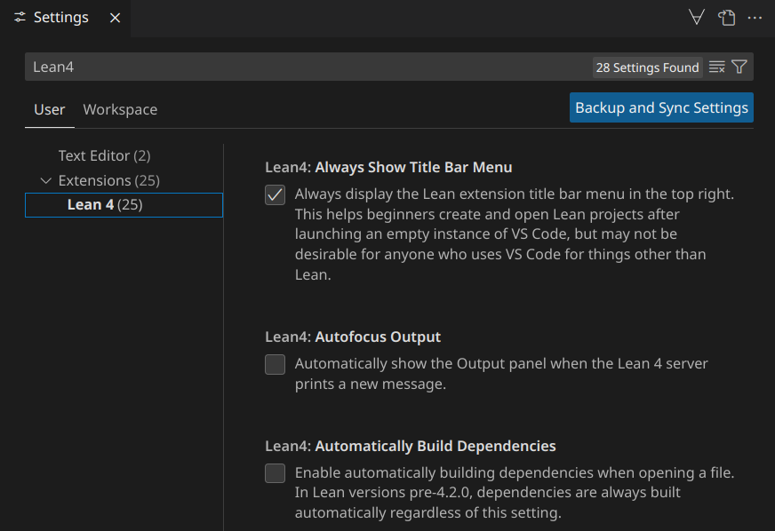 | 
| :--: | 
| *VS Code 'Settings' page* |

---

## Using commands

The Lean 4 VS Code extension provides several VS Code commands to interact both with the Lean 4 VS Code extension and Lean 4 itself.

When no Lean 4 document has been selected yet, only specific commands that do not need an associated Lean 4 document can be used. This includes [creating Lean projects](#creating-projects), [opening Lean projects](#opening-projects), [displaying troubleshooting information](#troubleshooting-issues), [managing Lean versions](#managing-lean-versions) and various documentation commands, like the command to open this manual.

When a Lean 4 document has been selected once, additional commands that can only operate in the context of a Lean 4 document become available. This includes [restarting files](#file-restarting), [restarting Lean](#restarting-lean), [toggling the InfoView](#infoview) and [executing project actions](#project-actions) in the Lean project associated with the given Lean 4 document. When executing one of these commands, the command will operate in the context of the last Lean 4 document that has been focused in VS Code.

The specific commands that are provided by the Lean 4 VS Code extension are described in detail in later sections.

### Command menu

When any text document is open, VS Code displays a ∀-symbol in the top right of the currently focused document. Clicking this symbol will open the command menu of the Lean 4 VS Code extension. 

The command menu displays all commands that are provided by the Lean 4 VS Code extension and that can be applied in the current context. Specifically, when no Lean 4 document has been selected yet, it will only display commands that do not need an associated Lean 4 document, whereas it will display all commands once a Lean 4 document has been selected once.

To hide the ∀-symbol in the top right of the currently focused document when no Lean 4 document has been selected yet, the 'Lean 4: Always Show Title Bar Menu' setting can be disabled.

<br/>

| 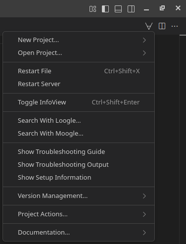 | 
| :--: | 
| *Lean 4 VS Code extension command menu* |

### Command palette

All commands can be accessed using the [command palette](command:workbench.action.showCommands) at 'View' > 'Command Palette…' or using `Ctrl+Shift+P` (`Cmd+Shift+P`). Typing in 'Lean 4' will display all commands of the Lean 4 VS Code extension. If no Lean 4 document has been selected yet, it will only display commands that do not need an associated Lean 4 document.

<br/>

| 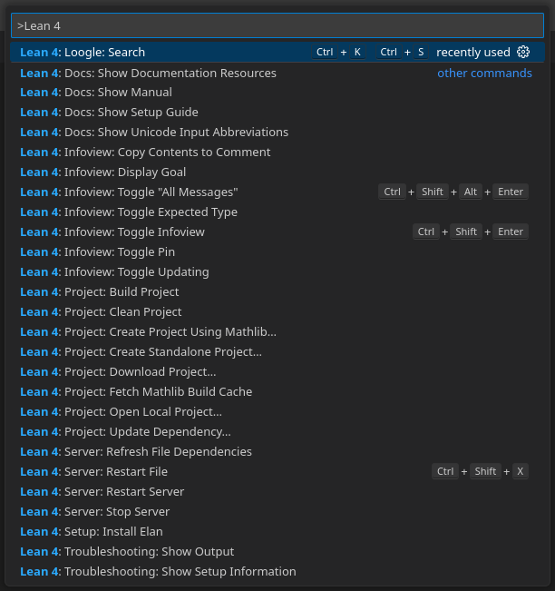 | 
| :--: | 
| *VS Code command palette* |

### Chords

Many commands in VS Code are bound to chord keyboard shortcuts where multiple keys must be pressed in succession to trigger the command. Chords in VS Code are typically of the form `Ctrl+K Ctrl+<some other key>` (`Cmd+K Cmd+<some other key>`), which can be triggered by holding `Ctrl` (`Cmd`), pressing `K`, releasing `K` and then pressing `<some other key>`.

### Configuring keyboard shortcuts

The [keyboard shortcuts](command:workbench.action.openGlobalKeybindings) for all commands can be configured by navigating to 'File' > 'Preferences' > 'Keyboard Shortcuts'. Typing in 'Lean 4' will display all commands of the Lean 4 VS Code extension.

<br/>
 
| 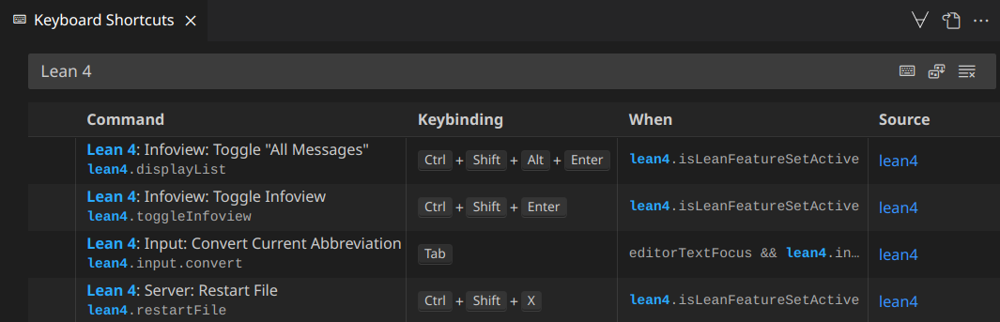 | 
| :--: |
| *VS Code keyboard shortcut settings* |

---

## Interacting with Lean files

This section describes how to use the Lean 4 VS Code extension to interact with, read and navigate individual Lean files.

### File processing

When opening a Lean file, Lean must first process the file in order to provide most interactive features for it. Since Lean files can contain arbitrary automation that needs to be executed when processing the file, doing so can be potentially expensive. 

The current progress for processing the file is displayed using an orange bar on the right side of the editor as part of the scroll bar. Areas of the file that are marked with the orange bar are still being processed, whereas areas of the file where the orange bar has already disappeared have finished processing. An orange bar on the left side of the editor displays which of the source code lines that are currently visible in the editor are still being processed.

When making a change to a file, Lean needs to re-process all declarations that can depend on the declaration that the change was made to. Currently, this means that all code below the point where the change occured needs to be re-processed.

For parts of the file that are currently still being processed, Lean cannot provide any interactive features that require file processing information yet. For example, in unprocessed parts of the file, [errors, warnings and information](#errors-warnings-and-information) are not displayed, the [InfoView](#infoview) will not show the current goal state and [hovers](#hovers) will not display a popup until file processing has progressed to the respective part of the file.

<br/>

| 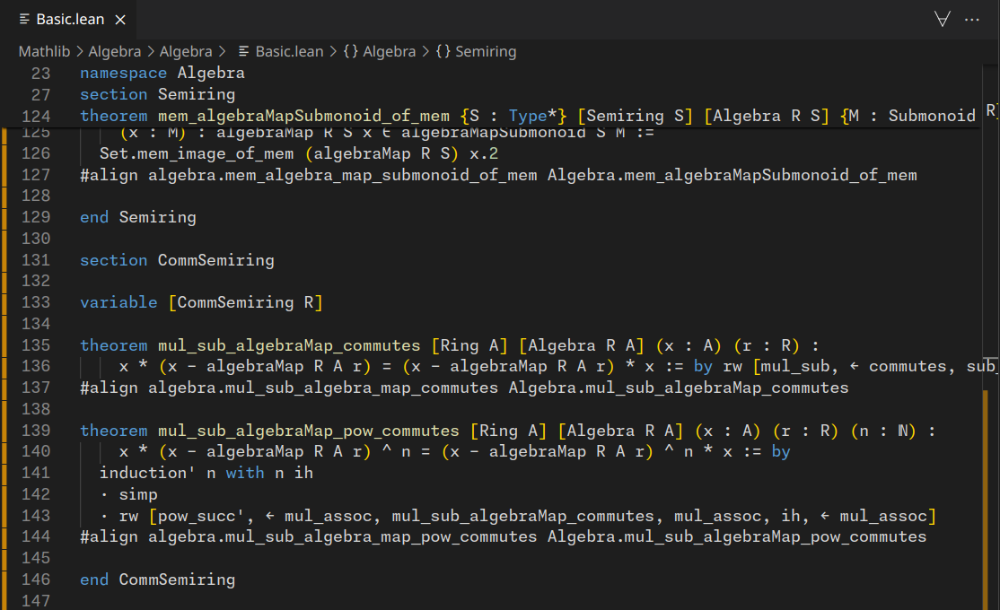 | 
| :--: | 
| *File processing progress. The orange bar on the right displays the progress for the whole file, whereas the one on the left displays the progress for the currently visible source code lines.* |

### Errors, warnings and information

VS Code displays so-called diagnostics of three severities directly in Lean files using squiggly lines underneath the affected code:
1. **Errors**. A red squiggly line denotes an error that occured while processing this part of the file. For example, syntax errors are denoted using red squiggly lines.
1. **Warnings**. An orange squiggly line denotes a potential issue in this part of the file. For example, unused variables are denoted using orange squiggly lines.
1. **Information**. A blue squiggly line denotes additional information that was produced by this part of the file. For example, `#check 0` will produce a blue squiggly line below `#check`.

Hovering over code that is underlined with a squiggly line will display the contents of the error, warning or information in a [hover popup panel](#hovers). 

Positioning the text cursor on the source code line containing the squiggly line will also make an interactive version of the content of the diagnostic show up in the 'Messages' section of the [InfoView](#infoview). The 'All Messages' section displays all interactive diagnostic contents of the whole file.

To reduce visual clutter, for diagnostics that span multiple lines, only the first line of the diagnostic is underlined with a squiggly line. Nonetheless, the diagnostic will show up under 'Messages' whenever the cursor is in the full span of the diagnostic, not just when it is positioned on its first line.

In the scroll bar on the right of the editor, red / orange / blue areas denote that this part of the file contains a diagnostic with the respective severity.

The amount of diagnostics for all open files are displayed in the left portion of the status bar at the bottom of VS Code using error, warning and information symbols. Clicking this section of the status bar will open the 'Problems view' of VS Code that displays all diagnostics for all currently open files and that can be used to quickly navigate to the span of the diagnostic by clicking on an entry or by using the arrow keys and `Enter`. It can also be opened using the ['View: Show Problems'](command:workbench.actions.view.problems) command or `Ctrl+Shift+M` (`Cmd+Shift+M`).

Using the ['Error Lens'](command:extension.open?%5B%22usernamehw.errorlens%22%5D) VS Code extension, the line that a diagnostic occurs in is highlighted and the message of the diagnostic is displayed inline in the editor.

<br/>

| 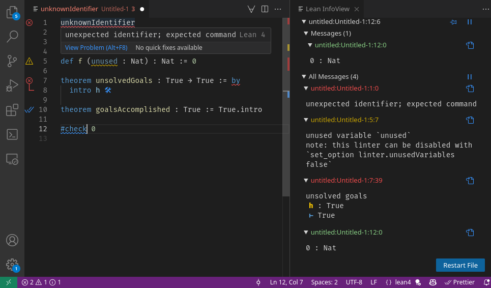 | 
| :--: | 
| *Error, warning and information diagnostics with corresponding hover- and InfoView information. The red / orange / blue areas in the scroll bar denote the location of the area. The bottom left of the status bar at the bottom of VS Code displays the amount of diagnostics in all open files and clicking this section of the status bar will open the 'Problems view'.* |

<br/>

| 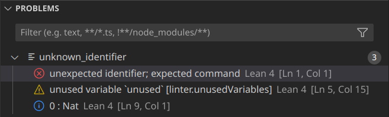 | 
| :--: | 
| *VS Code 'Problems view'* |

### File restarting

When a file `Module.lean` imports another file `Submodule.lean`, changes in `Submodule.lean` do not automatically become visible in `Module.lean`. This is to prevent accidentally triggering expensive builds of all dependents of `Submodule.lean`.

Instead, the state of all dependencies of `Module.lean` needs to be updated manually using the ['Server: Restart File'](command:lean4.restartFile) command. This will trigger a build for all changed dependencies. The command can be called using `Ctrl+Shift+X` (`Cmd+Shift+X`), using the 'Restart File' button in the InfoView, using the [command menu](#command-menu), using the [command palette](#command-palette) or by right clicking in the editor of a Lean file and selecting the 'Server: Restart File' entry in the context menu.

VS Code will display [error- or information-level diagnostics](#errors-warnings-and-information) whenever a dependency of a file is edited and saved. When initially opening a file and a dependency would need to be rebuilt to be up-to-date, it issues an error and refuses to [process](#file-processing) the rest of the file. When a dependency changes while the file is already open, it issues an information-level diagnostic, but will continue processing the file with the previous state of the dependency.

In order to automatically trigger rebuilds of all changed dependencies when opening a file instead of issuing an error, the 'Lean 4: Automatically Build Dependency' setting can be enabled.

<br/>

|  | 
| :--: | 
| *'Restart File' button in InfoView* |

### Unicode input

Lean code uses lots of [Unicode symbols](https://home.unicode.org/) to aid readability. In Lean files, these Unicode symbols can be entered by typing a backslash followed by an abbreviation identifier referring to the symbol. As soon as the abbreviation identifier is complete, if the abbreviation identifier is not a prefix of any other abbreviation identifier, the abbreviation will be automatically replaced with the corresponding Unicode symbol - for example, `\forall` will yield `∀`. 

To replace an abbreviation early, before it is complete, `Tab` can be pressed to trigger the ['Input: Convert Current Abbreviation'](command:lean4.input.convert) command. This will yield the Unicode symbol with the shortest abbreviation identifier matching the identifier that was typed. Abbreviations are also replaced early when the text cursor is moved away from the abbreviation.

The full list of supported abbreviation identifiers and Unicode symbols can be viewed using the ['Docs: Show Unicode Input Abbreviations'](command:lean4.docs.showAbbreviations) command that can be found in the 'Documentation…' submenu of the command menu. When encountering a Unicode symbol in Lean code, [hovering](#hovers) over the symbol will also provide all available abbreviation identifiers to input the symbol.

For some Unicode brackets, there are special abbreviation identifiers that also insert a matching closing Unicode bracket and ensure that the cursor is in-between the Unicode brackets after replacing the abbreviation. For example, `\<>` yields `⟨⟩`, `\[[]]` yields ``, `\f<<>>` yields `«»` and `\norm` yields `‖‖`.

The Unicode input mechanism has several configuration options:
- **'Lean 4 > Input: Custom Translations'**. Allows adding additional abbreviation identifiers. For example, `{"foo": "☺"}` will add an abbreviation `\foo` that yields `☺`. Entries must be comma-separated.
- **'Lean 4 > Input: Eager Replacement Enabled'**. Unticking this option will disable automatic replacement of complete abbreviations, instead requiring that every abbreviation is replaced using `Tab`.
- **'Lean 4 > Input: Enabled'**. Unticking this option will disable the entire Unicode input mechanism.
- **'Lean 4 > Input: Languages'**. Allows adding [VS Code language IDs](https://code.visualstudio.com/docs/languages/identifiers) for which the Unicode input mechanism should also be enabled.
- **'Lean 4 > Input: Leader'**. Allows replacing the initial character of an abbreviation (`\`) with something else.

<br/>

| 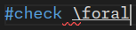 | 
| :--: | 
| *Incomplete abbreviation for `∀`* |

<br/>

| 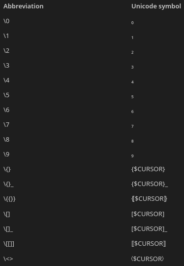 | 
| :--: | 
| *Output when the 'Docs: Show Unicode Input Abbreviations' command is used* |

<br/>

| 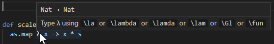 | 
| :--: | 
| *Hover for Unicode symbol displaying all abbreviation identifiers* |

### InfoView

The InfoView is the main interactive component of Lean. It can be used to inspect proof goals, expected types and [diagnostics](#errors-warnings-and-information), as well as render arbitrary user interfaces called ['widgets'](#widgets) for Lean code.

When a Lean document is opened, the InfoView is automatically displayed next to the text document. It can always be toggled using the ['Infoview: Toggle Infoview'](command:lean4.toggleInfoview) command or by using `Ctrl+Shift+Enter` (`Cmd+Shift+Enter`). To stop the InfoView from automatically opening, the 'Lean 4 > Infoview: Auto Open' setting can be disabled. 

The InfoView can be moved into a seperate window for use on a second monitor by right-clicking the InfoView tab and clicking 'Move into New Window'.

The [CSS style](https://github.com/leanprover/vscode-lean4/blob/master/lean4-infoview/src/infoview/index.css) of the InfoView can be configured using the 'Lean 4 > Infoview: Style' setting.

#### Sections

The InfoView is subdivided into several sections, most of which are only displayed when the text cursor is positioned in a specific place:
1. **Tactic state**. If the text cursor is positioned in a tactic proof, the InfoView will display the current proof state with all currently open proof goals at the position of the cursor. Each proof goal is identified by a name and clicking on the name will collapse the respective proof goal. Proof goal names can be hidden using the 'Lean 4 > Infoview: Show Goal Names' setting.
1. **Expected type**. If the text cursor is positioned in a Lean term, the InfoView will display the current expected type at the position of the cursor. 
1. **Widget sections**. Widgets may add arbitrary additional sections to the InfoView that are only displayed when the respective widget is active.
1. **Messages**. If the text cursor is positioned on a line of the span of a [diagnostic](#errors-warnings-and-information), an interactive variant of the diagnostic is displayed. Disabling the 'Lean 4 > Infoview: All Errors On Line' option will only display errors that are to the right of the text cursor.
1. **All Messages**. Always displayed. Contains interactive variants of all [diagnostics](#errors-warnings-and-information) present in the file.

All sections can be collapsed by clicking on their title using the mouse, but the expected type and all messages sections can also be collapsed and uncollapsed using the ['Infoview: Toggle Expected Type'](command:lean4.infoView.toggleExpectedType) and ['Infoview: Toggle "All Messages"'](command:lean4.displayList) commands, respectively. The expected type section can also be collapsed by default using the 'Lean 4: Infoview > Show Expected Type' setting. 

Using the 'Lean 4 > Infoview: Debounce Time' setting, the InfoView can be made to update more or less quickly as the text cursor is moved around.

Disabling the 'Lean 4 > Infoview: Auto Open Shows Goal' setting will only display the 'All Messages' section when the InfoView is automatically opened.

<br/>

|  | 
| :--: | 
| *InfoView with 'Tactic state', 'Messages' and 'All Messages' sections.* |

#### Tactic state and expected type

Both the proof goals in the tactic state and the expected type display a list of assumptions and locally available identifiers in a `<name> : <type>` format. At the end of the list of assumptions, a `⊢` symbol indicates the proof goal or the expected type.

Inaccessible names, i.e. names that have been automatically generated and cannot be used in a Lean program, are marked with a tombstome symbol (`✝`) and greyed out.

When a proof goal changes as the result of a tactic operation, the corresponding part of the proof state that changes is highlighted using red or green depending on whether this part of the proof state is about to be removed or was just inserted.

In the top right of the tactic state and the expected type sections, there are three small icon buttons:
1. **Copy state to comment**. Inserts a comment at the current text cursor position containing the tactic state or expected type. Can also be called using the ['Infoview: Copy Contents to Comment'](command:lean4.infoView.copyToComment) command.
1. **Reverse list**. Displays the proof goal / expected type on top of the assumption list instead of at the bottom of it. The default behavior of this setting can be flipped using the 'Lean 4 > Infoview: Reverse Tactic State' setting.
1. **Filter**. Displays a menu that allows hiding types, instance assumptions, inaccessible names and the values of `let` bindings from the proof goal state or expected type.

When the 'Lean 4 > Infoview: Emphasize First Goal' setting is enabled, side goals will be rendered with a smaller font size.

#### Status bar

In the very top right of the InfoView, there are three icon buttons:
1. **Pin**. Takes the tactic state, expected type, messages and widget sections at the current cursor location and pins them to the top of the InfoView so that they are visible when inspecting the InfoView in other parts of the code. In pinned InfoView states, an additional **Reveal file location** icon button can be used to navigate to the place in the code where the InfoView state was pinned and the 'Pin' button is replaced with an 'Unpin' button. Can also be called using the ['Infoview: Toggle Pin'](command:lean4.infoView.toggleStickyPosition) command.
1. **Pause updating**. Freezes the tactic state, expected type, messages and widget sections. When frozen, the 'Pause updating' button is replaced with a 'Continue updating' button. Can also be called using the ['Infoview: Toggle Updating'](command:lean4.infoView.toggleUpdating) command.
1. **Update**. Re-fetches all InfoView data. It should typically not be necessary to use this button.

#### InfoView hovers

Hovering over any non-local identifiers in the InfoView will open a hover popup panel that contains the type of the identifier, as well as the documentation for the identifier. This can be repeated recursively: Hovering over an identifier in the type displayed in the hover popup panel will also display the type and documentation of that identifier.

When clicking an identifier, its hover popup panel becomes pinned so that it remains open when moving the mouse away from the popup panel. This can be especially helpful when right-clicking to use the context menu inside of a hover popup panel.

InfoView hovers can be disabled using the 'Lean 4 > Infoview: Show Tooltip On Hover' setting, though clicking identifiers to open and pin the popup panel will still be possible even with this setting disabled.

<br/>

| 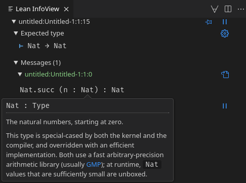 | 
| :--: | 
| *InfoView hover for `Nat`* |

#### InfoView 'Go to definition'

Right-clicking on any non-local identifier in the InfoView and selecting 'Go to Definition' will directly jump to the place in the code where the identifier was defined. Holding `Ctrl` (`Cmd`) and then clicking on the identifier will also directly jump to the place in the code where the identifier was defined.

<br/>

| 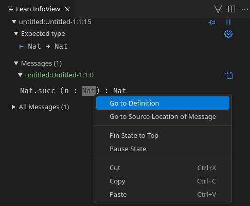 | 
| :--: | 
| *InfoView 'Go to Definition' on `Nat`* |

#### Widgets

[User widgets](https://lean-lang.org/lean4/doc/examples/widgets.lean.html) allow for extending the InfoView with arbitrary interactive components. Widgets are typically registered to activate in certain contexts, for example when a tactic is called, and may provide additional functionality when holding `Shift` and clicking a subexpression in the InfoView to select it as an input to the widget.

For an example of a built-in widget, calling the `simp?` tactic in a proof will display a 'Suggestions' section in the InfoView with a link that executes a [code action](#code-actions). The code action replaces the `simp?` tactic call with a `simp only` tactic invocation that lists all the theorems needed to simplify the expression.

When using Lean's math library, [Mathlib](https://github.com/leanprover-community/mathlib4), and importing `Mathlib.Tactic.Widget.Conv`, a `conv?` tactic can be called. Shift-clicking a subexpression in the proof goal will then generate a `conv` tactic invocation in place of `conv?` that focuses on that specific subexpression.

<br/>

| 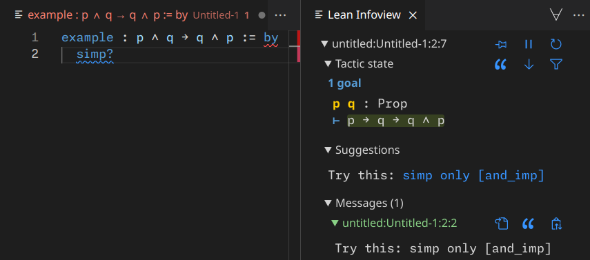 | 
| :--: | 
| *`simp?` 'Try this' widget* |

#### Theming

Some of the colors in the InfoView can be themed with a custom color theme or by configuring the 'Workbench: Color Customization' setting. The following components of the InfoView can be themed by setting one of the corresponding theme identifiers to the desired hex color code:
- `lean4.infoView.hypothesisName`: Accessible hypothesis names
- `lean4.infoView.inaccessibleHypothesisName`: Inaccessible hypothesis names
- `lean4.infoView.goalCount`: Number of goals
- `lean4.infoView.turnstile`: Turnstile (⊢) that separates hypotheses from the goal
- `lean4.infoView.caseLabel`: Case labels (e.g. `case zero`)

### Hovers

When hovering over parts of the code with the mouse pointer, VS Code will display additional information for that piece of code in a popup panel. Specifically:
1. **Identifiers**. When hovering over an identifier, VS Code will display the type of the identifier, the documentation of the identifier and which file it was imported from.
1. **Errors, warnings and information**. When hovering over a piece of code that is [underlined with a squiggly line](#errors-warnings-and-information), VS Code will display the error, warning or information associated with the squiggly line.
1. **Unicode symbols**. When hovering over a unicode symbol, VS Code will provide all available [abbreviation identifiers](#unicode-input) to input the symbol.

Automatic hovers can be disabled by un-ticking the 'Editor › Hover: Enabled' configuration option. This is especially helpful when presenting Lean 4 code to an audience.

Hovers can also be triggered at the current text cursor position using the keyboard with the `Ctrl+K Ctrl+I` (`Cmd+K Cmd+I`) [chord](#chords) or the ['Show or Focus Hover'](command:editor.action.showHover) command.

Moving the mouse away from the hover popup panel will immediately collapse it. Clicking on the hover popup panel will pin it so that it remains open when the mouse is moved away from the hover popup panel.

<br/>

|  | 
| :--: | 
| *Pinned hover popup panel with error and identifier information* |

### Auto-completion

Auto-completion is a mechanism that can be used to find identifiers that are available in the current context and to complete partial identifiers. The current context is determined by the current set of imports, as well as the set of available local declarations and variables. Auto-completion can always be triggered manually by using `Ctrl+Space` (`Option+Esc`) or the ['Trigger Suggest'](command:editor.action.triggerSuggest) command.

There are three different kinds of auto-completion in Lean 4:
1. **Dot completion**. When typing a dot after a namespace (`Namespace.`), after a term (`x.` or `(x + 1).`), after a pipe operator (`|>.`) or simply on its own (`.`), VS Code will display a complete list of identifiers that are available in the current context and that can be inserted after the dot. Specifically:
    - For namespaces, it will display all available sub-namespaces and identifiers that exist in the namespace (e.g. `Namespace.SubNamespace` or `Namespace.someFunction`).
    - For terms, it will display all available identifiers that exist in the namespace corresponding to the type of the term (e.g. `x.succ` for `x : Nat`).
    - On its own, it will display all available identifiers that exist in the namespace corresponding to the expected type at the position of the dot (e.g. `.zero` if the expected type is `Nat`).
1. **Identifier completion**. When typing an identifier and pausing for a moment, VS Code will display all identifiers that are available in the current context and match the identifier that has been typed so far. In most contexts, it is necessary to type at least the first character of the identifier for identifier completion to offer any options. 
1. **Import completion**. When triggering auto-completion at the very start of the file where the imports are denoted by pressing `Ctrl+Space` or by typing the first characters of an `import` declaration, VS Code will display all files that can be imported. Since support for this feature by Lean's package manager [Lake](https://github.com/leanprover/lean4/blob/master/src/lake/README.md) is still pending, in some Lean projects it will also display some files that are outside of the current Lean project and cannot actually be imported.

Next to the currently selected identifier in the completion menu, VS Code displays the type of the identifier and a small caret. Clicking this caret or hitting `Ctrl+Space` (`Option+Esc`) again will also display the documentation associated with the currently selected identifier.

By default, VS Code will auto-complete the selected identifier when `Enter` or `Tab` are pressed. Since `Enter` is also used to move the cursor to a new line, some users find this behavior to be irritating. This behavior can be disabled by setting the 'Accept Suggestion On Enter' configuration option to 'off'.

Additionally, by default, VS Code will display so-called word auto-completions that are based on the text in all files that are currently open whenever Lean provides no auto-completions itself. Word auto-completions can be disabled by setting the 'Editor: Word Based Suggestions' configuration option to 'off'.

<br/>

| 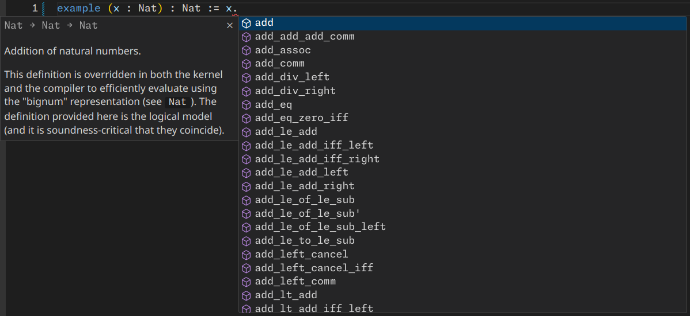 | 
| :--: | 
| *Completion menu for dot completion on `x : Nat`* |

### Code actions

Code actions are a mechanism for Lean to suggest changes to the code. When a code action is available at the current text cursor position, VS Code will display a light bulb icon. Clicking this icon or pressing `Ctrl+.` (`Cmd+.`) and then selecting one of the entries will apply the code action and make the suggested change to the code. In Lean, code actions can be defined in user code.

For example, the built-in `#guard_msgs` command can be used to test that a declaration produces a specific [diagnostic](#errors-warnings-and-information), e.g. `/-- info: 2 -/ #guard_msgs (info) in #eval 1` produces ```❌️ Docstring on `#guard_msgs` does not match generated message: info: 1```. When positioning the text cursor in the `#guard_msgs` line, a light bulb will pop up with an entry to replace the documentation above `#guard_msgs` with the actual output.

The [Batteries](https://github.com/leanprover-community/batteries) library also provides some additional useful code actions, for example:
- Typing `instance : <class> := _` will offer to generate a skeleton to implement an instance for `<class>`.
- Typing `def f : <type1> → <type2> := _` will offer to generate a match on the value of `<type1>`.
- Typing `induction x` or `cases x` will offer to generate the induction cases for `x`.

<br/>

| 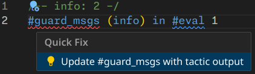 | 
| :--: | 
| *Code action for `#guard_msgs` command* |

### Occurrence highlighting

Placing the text cursor on an identifier will highlight all occurrences of the identifier in the current file. For occurrence highlighting to work, the text cursor must be moved into the identifier from the left or by directly clicking into it, not from the right.

When placing the text cursor on a `return` statement in a `do` block, the `do` that the `return` belongs to will be highlighted.

<br/>

|  | 
| :--: | 
| *Occurrence highlighting on a parameter `x`. Usages of the second semantically distinct `x` that shadows the parameter `x` are not highlighted.* |

### Semantic highlighting

By default, the Lean 4 VS Code extension will provide syntax highlighting for comments, built-in keywords, definition names, attributes, `sorry`, strings, numbers and booleans. However, due to the extensibility of Lean, the VS Code extension cannot provide syntax highlighting e.g. for user-defined keywords on its own. Because of this, Lean provides additional so-called semantic highlighting for Lean documents:
1. **Keywords**. All keywords, including user-defined ones, are highlighted.
1. **Projections**. Projection notation, e.g. `proj` in `value.proj`, `(value + 1).proj` or `value |>.proj`, is highlighted.
1. **Variables**. Local variables, e.g. `x` in `def f (x : Nat) : Nat := x`, are highlighted.
1. **Function declarations**. All function declaration names, e.g. the second occurrence of `g` in `def f : Nat := g 0 where g n := n`, are highlighted.

Whether these different kinds of syntax and semantic highlighting are actually distinguishable in the editor depends on the color theme that is selected in the menu at 'File' > 'Preferences' > 'Theme' > 'Color Theme', which can also be opened by using the `Ctrl+K Ctrl+T` (`Cmd+K Cmd+T`) [chord](#chords) or the ['Preferences: Color Theme'](command:workbench.action.selectTheme) command.

<br/>

|  | 
| :--: | 
| *Semantic highlighting in a proof* |

### Go to symbol

Using the ['Go to Symbol in Editor'](command:workbench.action.gotoSymbol) command that can be called by pressing `Ctrl+Shift+O` (`Cmd+Shift+O`), all the declarations, namespaces and sections of the current Lean document can be displayed and navigated by typing in the name of the respective identifier, clicking or using the arrow keys. Typing `:` will group all declarations, all sections and all namespaces.

<br/>

|  | 
| :--: | 
| *'Go to symbol' panel with grouped declarations* |

### Document outline

The document outline displays a brief overview of all the namespaces, sections and declarations of a Lean document. Clicking an entry will jump to the corresponding location in the code. It can be opened via 'View' > 'Open View' > 'Outline' or by using the ['Explorer: Focus on Outline View'](command:outline.focus) command.

<br/>

|  | 
| :--: | 
| *Document outline of a Lean 4 document* |

### Breadcrumbs bar

When positioning the text cursor at any position in a Lean document, VS Code will display a 'breadcrumbs bar' at the top of the editor and just underneath the tab bar that display the full semantic location of the cursor. This includes the file path of the document, namespaces, sections and the declaration that the cursor is in.

Clicking on any entry of the breadcrumbs will display a list of all available alternatives at the given level of the location. For example, clicking on a declaration in a namespace will display all other declarations in that namespace in the same file. Selecting any of these entries will directly navigate to the selected piece of code or document.

The breadcrumbs bar can also be focused using `Ctrl+Shift+;` (`Cmd+Shift+;`) or the ['Focus Breadcrumbs'](command:breadcrumbs.focus) command and then navigated using the arrow keys and `Enter`. 

<br/>

|  | 
| :--: | 
| *Breadcrumbs bar with expanded namespace contents* |

### Collapsible code blocks

When hovering over the left column of a Lean document editor that contains the line numbers, VS Code will display a caret next to every namespace, section and declaration. Clicking this caret, using the `Ctrl+K Ctrl+L` (`Cmd+K Cmd+L`) [chord](#chords) or the ['Toggle Fold'](command:editor.toggleFold) command will collapse this part of the document. Clicking the caret again or using the same command as before will unfold this block of code again.

Similar to the [document outline](#document-outline) or the [breadcrumbs bar](#breadcrumbs), collapsible code blocks can be used to gain an overview over a Lean document and quickly navigate it, e.g. by using the ['Fold All'](command:editor.foldAll) command or the `Ctrl+K Ctrl+0` (`Cmd+K Cmd+0`) [chord](#chords) to collapse all code blocks and later using the ['Unfold All'](command:editor.unfoldAll) command or the `Ctrl+K Ctrl+J` chord to unfold all code blocks again.

<br/>

| 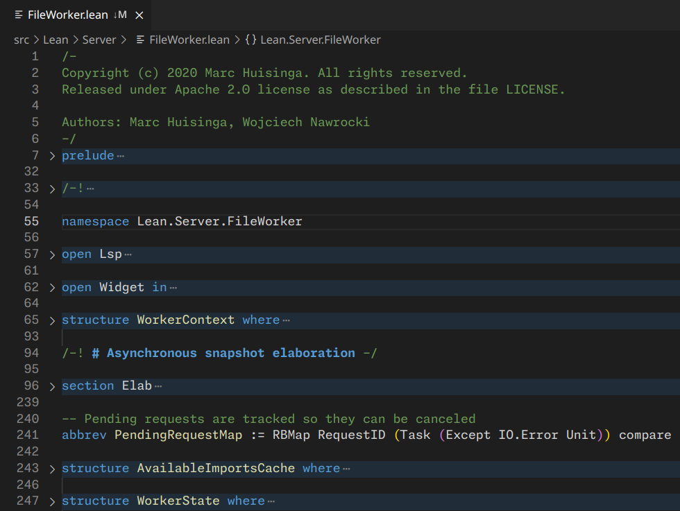 | 
| :--: | 
| *Lean 4 document with several folded code blocks* |

### Sticky scroll

When scrolling through a Lean document, at the top of the editor, VS Code will display source code lines corresponding to the surrounding namespaces, sections and declarations of the first line of code that is displayed in the editor. Clicking on one of these lines will immediately jump to the corresponding line in the source code.

Sticky scroll is also supported in the VS Code explorer and the VS Code terminal. 

<br/>

|  | 
| :--: | 
| *Sticky scroll of surrounding namespaces, sections and declaration at the top of the editor* |

---

## Navigating Lean projects

This section covers several essential tools to efficiently navigate Lean projects.

### Go to definition, declaration and type definition

To jump to the place in the code where an identifier was defined, the ['Go to Definition'](command:editor.action.revealDefinition) command can be used by positioning the text cursor on the identifier and pressing `F12`, by right clicking on the identifier and selecting 'Go to Definition' or by holding `Shift` and clicking on the identifier. 

The ['Go to Declaration'](command:editor.action.revealDeclaration) command that can be used via the context menu is currently mostly identical to 'Go to Definition', with the only significant difference being that when 'Go to Definition' jumps to the elaborator of an identifier, 'Go to Declaration' will instead jump to the parser.

The ['Go to Type Definition'](command:editor.action.goToTypeDefinition) command that can be used via the context menu jumps to the type of the identifier at the cursor position.

<br/>

| 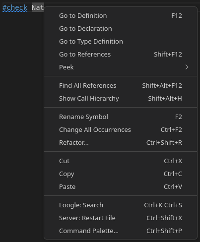 | 
| :--: | 
| *Context menu when right-clicking on an identifier. Contains 'Go to Definition', 'Go to Declaration', 'Go to Type Definition', ['Find All References'](#find-references) and ['Show Call Hierarchy'](#call-hierarchy) entries.* |

### Call hierarchy

Using the ['Calls: Show Call Hierarchy'](command:references-view.showCallHierarchy) command by right clicking on an identifier and selecting 'Show Call Hierarchy' or by positioning the text cursor on the identifier and pressing `Alt+Shift+H` will display a list of all declarations that use this identifier in the entire Lean project. Clicking one of the carets next to a usage will also recursively display all usages of that usage. This makes it possible to quickly understand all the contexts that an identifier is used in. The call hierarchy can also be navigated using the arrow keys and `Enter`.

Clicking the phone icon button in the top right of the call hierarchy view or using the ['Calls: Show Outgoing Calls'](command:references-view.showOutgoingCalls) command will instead switch the call hierarchy to display all the identifiers that are used in the declaration of a given identifier. This can be useful to quickly gain an overview for the different identifiers that a declaration depends on.

When going through a long list of usages and checking that a property holds for every single one of them, it can sometimes be helpful to delete individual entries from the usage list that have already been checked. This can be done by hovering over a call hierarchy entry and clicking the X icon button on the right side of the call hierarchy.

<br/>

|  | 
| :--: | 
| *Call hierarchy view displaying all usages of an identifier* |

<br/>

|  | 
| :--: | 
| *Call hierarchy view displaying all identifiers used in the declaration of an identifier* |

### Find references

The ['References: Find All References'](command:references-view.findReferences) command can be called by right clicking on an identifier and selecting 'Find All References' or by positioning the text cursor on an identifier and pressing `Alt+Shift+F12`. It is similar to the ['Show Call Hierarchy'](#call-hierarchy) command, but organizes usages by files, not declarations, displays a short snippet of the code where the identifier is used and cannot walk through usages recursively.

<br/>

| 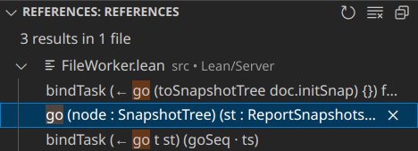 | 
| :--: | 
| *'Find references' view displaying all direct usages of an identifier* |

### Workspace symbol search

Using the ['Go to Symbol in Workspace…'](command:workbench.action.showAllSymbols) command that can be triggered using `Ctrl+T` (`Cmd+T`) or via `Ctrl+P` (`Cmd+P`) and then entering a `#` symbol will open a search panel. Typing identifiers into this search panel will perform a fuzzy search over all available identifiers in the current Lean project. Clicking an identifier or selecting one using the arrow keys and `Enter` will jump to the place in the code where the identifier was declared. Doing so is typically more efficient than using a plain-text search because it will not yield any false-positives.

<br/>

| 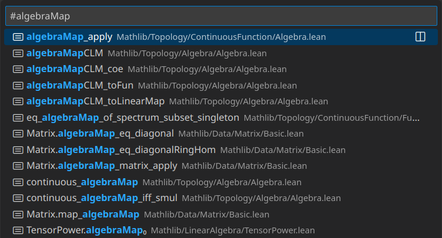 | 
| :--: | 
| *Workspace symbol search* |

### Project text search

The ['Search: Find in Files'](command:workbench.action.findInFiles) command that can be triggered using `Ctrl+Shift+F` is useful when searching for portions of text in a Lean project. Typing a portion of text will display all matches in the project, grouped by the directory and file they occur in. Clicking on any entry will jump to the respective location in the code. To use this feature, the Lean project folder must first be opened in VS Code using the ['File: Open Folder…'](command:workbench.action.files.openFolder) command that can be accessed via 'File' > 'Open Folder' or using the `Ctrl+K Ctrl+O` (`Cmd+K Cmd+O`) [chord](#chords).

Past search results can be accessed using the `Up` and `Down` arrow keys when the search input is focused.

There are several ways to refine the search in the form of icon buttons in the right of the search field:
- **Match case**. Limits the search results to case sensitive matches. For example, `word` will not match `Word` anymore. Can also be toggled using the ['Search Editor: Toggle Match Case'](command:toggleSearchEditorCaseSensitive) command or `Alt+C`.
- **Match whole world**. Limits the search results to matches where the full word matches. For example, `word` will not match `largerword` anymore. Can also be toggled using the ['Search Editor: Toggle Match Whole Word'](command:toggleSearchEditorWholeWord) command or `Alt+W`.
- **Use regular expression**. Instead of searching for a portion of text, search files using a [regular expression](https://developer.mozilla.org/en-US/docs/Web/JavaScript/Guide/Regular_expressions). Can also be toggled using the ['Search Editor: Toggle Use Regular Expression'](command:toggleSearchEditorRegex) command or `Alt+R`.

On the right below the search bar, there is an icon button with three dots. Clicking it will open two more text inputs that allow limiting the search to a set of files or excluding a set of files from the search. Clicking the book icon button in the 'Files to include' text input will additionally limit the search to only open files.

Search results can also be viewed in a more structured hierarchical view by clicking the fourth icon button in the top right of the search view that looks like a bunch of horizontal lines. This will display search results as they appear in the file structure of the project, making it easier to quickly collapse entire folders of search results that are not relevant.

Clicking the caret on the left of the text input will open the 'Replace' text field that can be used to replace all search results with another string. If the 'Use regular expressions' mode has been activated, capturing groups in the regex can be referred to using `$1`, `$2`, etc.

When going through a long list of search results, it can sometimes be helpful to delete individual entries from the search results that have already been checked. This can be done by hovering over a search result and clicking the 'X' icon button on the right side of the search view.

By clicking on the third icon button in the top right of the search view that contains the file icon or by using the ['Search Editor: New Seach Editor'](command:search.action.openNewEditor) command, an alternative search view is opened where search results are displayed directly in a text editor. Clicking in the text editor will navigate to the respective location in the code.

<br/>

|  | 
| :--: | 
| *Search view with enabled hierarchical tree display option* |

### Go to file

Using the ['Go to File'](command:workbench.action.quickOpen) command by pressing `Ctrl+P` (`Cmd+P`) brings up a search prompt that allows for typing in a file name to open and focus. It can be used to quickly navigate files using the keyboard.

To use this feature, the Lean project folder must first be opened in VS Code using the ['File: Open Folder…'](command:workbench.action.files.openFolder) command that can be accessed via 'File' > 'Open Folder…' or using the `Ctrl+K Ctrl+O` (`Cmd+K Cmd+O`) [chord](#chords).

<br/>

| 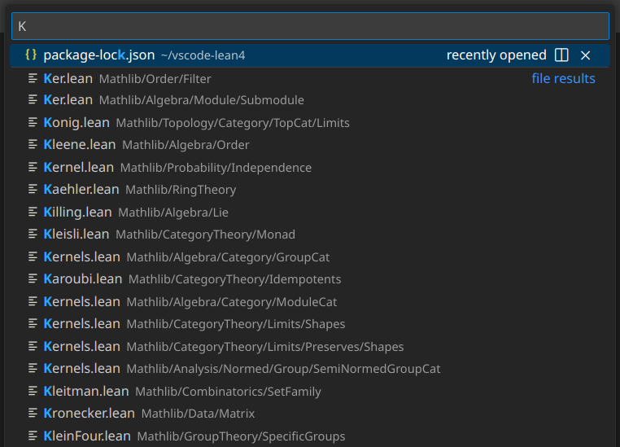 | 
| :--: | 
| *'Go to file' panel with a search for file names containing 'K'* |

### Explorer

VS Code has a built-in file explorer that can be opened using the ['View: Show Explorer'](command:workbench.view.explorer) command or `Ctrl+Shift+E` (`Cmd+Shift+E`). It can be navigated using the mouse, arrow keys and `Enter` or by typing in the name of the file or folder to jump to. Using the context menu that can be opened by right-clicking, the built-in file explorer also supports several basic file operations, like creating, deleting, copying or renaming files with their standard keyboard shortcuts.

By default, VS Code will always focus the file in the explorer for which an editor is currently being focused. This means that over time, VS Code will keep expanding folders. To re-gain a top-down hierarchical perspective of the file tree and collapse all folders, the fourth icon button in the top right of the explorer view can be pressed to call the ['Collapse Folders in Explorer'](command:workbench.files.action.collapseExplorerFolders) command.

Selecting two files by holding `Ctrl` (`Cmd`) and then clicking them presents a 'Compare Selected' entry in the context menu when right-clicking any of the files. This will open a diff-view displaying changes between the two files.

<br/>

| 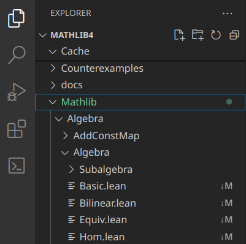 | 
| :--: | 
| *VS Code file explorer* |

---

## Managing Lean projects

This section describes how to manage Lean projects using the Lean 4 VS Code extension. All of these commands provide a frontend for Lean's package manager [Lake](https://github.com/leanprover/lean4/blob/master/src/lake/README.md).

### Creating projects

There are two project creation commands that can be accessed using the [command palette](#command-palette) or by navigating to the 'New Project…' submenu in the [command menu](#command-menu):
1. **['Project: Create Standalone Project…'](command:lean4.project.createStandaloneProject)**. This command will create a new Lean 4 project with the name specified in the folder creation dialog and without any additional dependencies. It will use the `leanprover/lean4:stable` Lean release channel for the Lean version of the project, initialize a [Git](https://git-scm.com/) repository and create an initial commit with all the files in the fresh project.
1. **['Project: Create Project Using Mathlib…'](command:lean4.project.createMathlibProject)**. This command will create a new Lean 4 project with the name specified in the folder creation dialog that depends on Lean's math library, [Mathlib](https://github.com/leanprover-community/mathlib4). It will use Mathlib's Lean version for the project, download and install the current Mathlib build artifact cache, initialize a [Git](https://git-scm.com/) repository and create an initial commit with all the files in the fresh project.

### Opening projects

There are two commands to open existing Lean projects that can be accessed using the [command palette](#command-palette) or by navigating to the 'Open Project…' submenu in the [command menu](#command-menu):
1. **['Project: Open Local Project…'](command:lean4.project.open)**. This command will open a Lean 4 project in the folder specified by a folder selection dialog. This command is mostly identical to VS Code's own 'Open Folder…' command, but will also immediately ensure that the opened folder is actually a Lean 4 project.
1. **['Project: Download Project…'](command:lean4.project.clone)**. This command will download a Lean 4 project from a given URL into the folder specified by a folder creation dialog. If the downloaded project is Lean's math library [Mathlib](https://github.com/leanprover-community/mathlib4) or depends on it, it will also download and install the current Mathlib build artifact cache.

### Project actions

The Lean 4 VS Code extension supports the following commands that can be run in existing Lean projects and that can be accessed using the [command palette](#command-palette) or by navigating to the 'Project Actions…' submenu in the [command menu](#command-menu):
1. **['Project: Build Project'](command:lean4.project.build)**. Builds the full Lean project. If the project is Lean's math library [Mathlib](https://github.com/leanprover-community/mathlib4) or depends on it, it will also download and install the current Mathlib build artifact cache before trying to build the project.
1. **['Project: Clean Project'](command:lean4.project.clean)**. Removes all build artifacts for the Lean project. If the project is [Mathlib](https://github.com/leanprover-community/mathlib4) or depends on it, it will also offer to download and install the current Mathlib build artifact cache after cleaning the project.
1. **['Project: Update Dependency…'](command:lean4.project.updateDependency)**. Displays a list of all dependencies that can be updated. After selecting a dependency and updating it, if the project is [Mathlib](https://github.com/leanprover-community/mathlib4) or depends on it, it will also download and install the current Mathlib build artifact cache. At the end, if the Lean version of the updated project differs from the Lean version of the project, the command will offer to update the Lean version of the project to that of the updated dependency.
1. **['Project: Fetch Mathlib Build Cache'](command:lean4.project.fetchCache)**. Downloads and installs the current Mathlib build artifact cache if the project is [Mathlib](https://github.com/leanprover-community/mathlib4) or depends on it.
1. **['Project: Fetch Mathlib Build Cache For Current Imports'](command:lean4.project.fetchFileCache)**. Downloads and installs the current Mathlib build artifact for the focused file and all of its imports if the project is [Mathlib](https://github.com/leanprover-community/mathlib4).
1. **['Project: Select Project Lean Version…'](command:lean4.project.selectProjectToolchain)**. Displays a list of all available Lean versions. After selecting a Lean version, the command writes the selected Lean version to the `lean-toolchain` file of the given project.

<br/>

| 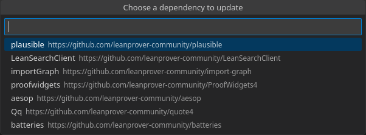 | 
| :--: | 
| *'Project: Update Dependency…' selection dialog* |

<br/>

| 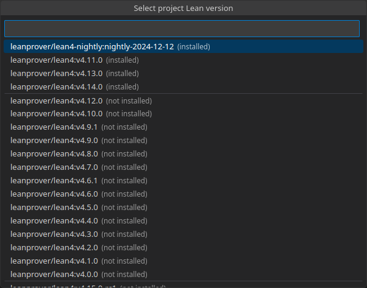 | 
| :--: | 
| *'Project: Select Project Lean Version…' selection dialog* |

### Terminal

If the commands provided by the Lean 4 VS Code extension are not sufficient to manage the Lean project, then a built-in VS Code terminal can be launched by calling the ['Terminal: Create New Terminal'](command:workbench.action.terminal.new) command or by pressing ``` Ctrl+Shift+` ``` (``` Cmd+Shift+` ```). In this terminal, all [Lake](https://github.com/leanprover/lean4/blob/master/src/lake/README.md) commands can be executed.

<br/>

|  | 
| :--: | 
| *VS Code terminal view* |

---

## Managing Lean versions

This section covers how to manage different Lean versions. All of these commands provide a frontend for Lean's version manager [Elan](https://github.com/leanprover/elan/blob/master/README.md) and can be found using the [command palette](#command-palette) or by navigating to the 'Version Management…' submenu in the [command menu](#command-menu).

### Elan

[Elan](https://github.com/leanprover/elan/blob/master/README.md) is Lean's version manager. It automatically installs Lean versions when a Lean command like `lean` or `lake` is used depending on the current working directory of the command.

When used inside of a Lean project with a `lean-toolchain` file, Elan will use the Lean version denoted in the `lean-toolchain` file. Outside of a Lean project, Elan will use the default Lean version that can be configured using the `elan default <version>` command. 

Lean versions can either be specific Lean versions, like `leanprover/lean4:v4.14.0`, or release channels, like `leanprover/lean4:stable`, which is Elan's default Lean version when Elan is first installed. Elan's release channels resolve to the most recent specific Lean version in a given release channel. 
Before Elan 4.0.0, release channels were explicitly installed in Elan, would resolve to the most recent version at the point of installation and could be manually updated to the most recent version in the release channel using the `elan toolchain update <release channel>` command. 
Since Elan 4.0.0, release channels cannot be installed anymore, but whenever they are used anywhere, e.g. when running `lean` with a default Lean version of `leanprover/lean4:stable`, they will automatically resolve to the most recent Lean version for that release channel. This means that since Elan 4.0.0, release channels are updated on-the-go and do not need to be kept up-to-date manually. When Elan cannot resolve a release channel, e.g. because the machine it runs on has no network connection, it will attempt to fall back to the last installed Lean version of that release channel. 

Before Elan 4.0.0, the Lean 4 VS Code extension would always automatically install missing Lean versions as it encountered them by using Elan in exactly the same way as it works on the command line. 
Since Elan 4.0.0, the Lean 4 VS Code extension now has a 'Lean 4: Always Ask Before Installing Lean Versions' setting that can be enabled to issue a confirmation prompt every time before a Lean version is installed by Elan. Additionally, regardless of this setting, the Lean 4 VS Code extension will always issue a confirmation prompt when opening a Lean file that is using a release channel for its version if there is a new Lean version for the release channel available.

### Selecting default Lean versions

Elan's default Lean version can be selected using the ['Setup: Select Default Lean Version…'](command:lean4.setup.selectDefaultToolchain) command. The command queries all installed Lean version and fetches all available Lean versions from [https://release.lean-lang.org/](https://release.lean-lang.org/) to present them in a selection dialog.

<br/>

| 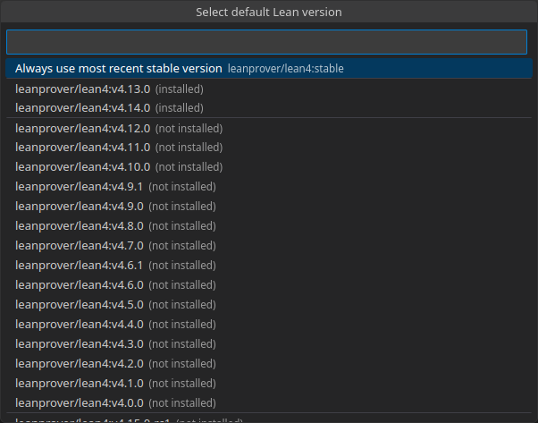 | 
| :--: | 
| *'Setup: Select Default Lean Version…' selection dialog* |

### Updating Lean release channels

The newest versions of the `leanprover/lean4:stable` and `leanprover/lean4:nightly` release channels can be installed manually using the 'Setup: Update Release Channel Lean Version…' command. The command uses Elan to resolve `leanprover/lean4:stable` and `leanprover/lean4:nightly` to determine their most recent versions and displays them in a selection dialog if an update for the respective Lean release channel is available.

<br/>

| 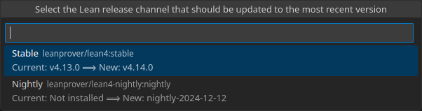 | 
| :--: | 
| *'Setup: Update Release Channel Lean Version…' selection dialog* |

### Uninstalling Lean versions

Installed Lean versions can be uninstalled using the 'Setup: Uninstall Lean Versions…' command. The command determines all unused Lean versions using Elan's Lean version garbage collector and displays a selection dialog for uninstalling all unused Lean versions, as well as additional individual Lean versions and the projects they are used in.

<br/>

| 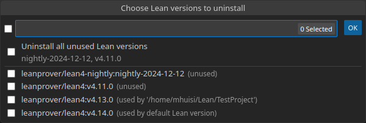 | 
| :--: | 
| *'Setup: Uninstall Lean Versions……' selection dialog* |

### Installing, updating and uninstalling Elan

Elan can be installed using the ['Setup: Install Elan'](command:lean4.setup.installElan) command. Similarly, the ['Setup: Update Elan'](command:lean4.setup.updateElan) command can be used to update Elan to the newest version and the ['Setup: Uninstall Elan'](command:lean4.setup.uninstallElan) command can be used to remove Elan and all installed Lean versions from the machine.

After installing Elan or updating it from a pre-4.0.0 version, the Lean 4 VS Code extension will also prompt users about whether they want to set the ['Lean 4: Always Ask Before Installing Lean Versions' setting](#elan).

---

## Finding definitions and theorems

This section covers how to find definitions and theorems in key Lean libraries like [Mathlib](https://github.com/leanprover-community/mathlib4) using the Lean 4 VS Code extension.

### LoogleView

[Loogle](https://loogle.lean-lang.org/), a search engine for definitions and theorems in Lean's standard library and a recent version of [Mathlib](https://github.com/leanprover-community/mathlib4), can be accessed from within VS Code using the ['Loogle: Search'](command:lean4.loogle.search) command. It can be called using the `Ctrl+K Ctrl+S` (`Cmd+K Cmd+S`) [chord](#chords), from the right click context menu in a Lean file, using the [command palette](#command-palette) or directly from the [command menu](#command-menu). The LoogleView can always be closed using `Escape`.

When selecting text in a text editor before calling ['Loogle: Search'](command:lean4.loogle.search), Loogle will immediately search for the selected text. The input field supports the same [Unicode input](#unicode-input) as the text editor when editing Lean files. Clicking the magnifier icon or pressing `Enter` will search for the given query. Clicking the arrow icons or using the up and down arrow keys will cycle through past queries. The query syntax supported by Loogle is described in the LoogleView itself.

When querying Loogle, it will display either a list of results or a list of possible suggestions if no results were found. The LoogleView will only display the first 200 results matching the query. Each result displays the name of the identifier, the module where it is located and the type of the identifier. Clicking the identifier will launch a browser window in VS Code with the documentation for the given identifier. Clicking a suggestion provided by Loogle if no results were found will immediately issue a query with the given suggestion.

| 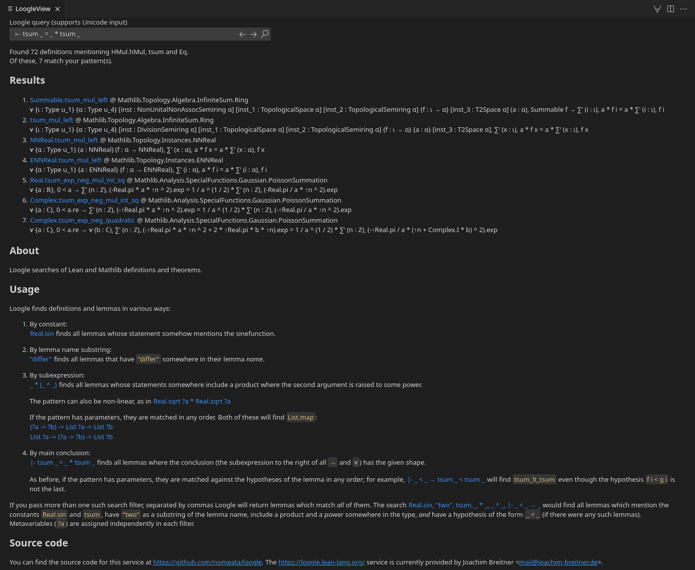 | 
| :--: | 
| *LoogleView* |

---

## Troubleshooting issues

This section covers several tools that can help diagnose issues with a Lean setup, the Lean 4 VS Code extension and Lean itself. 

### Setup diagnostics

The Lean 4 VS Code extension checks that the user's Lean setup is well-founded before starting Lean. There are two separate kinds of setup diagnostics: Global- and project-level diagnostics. 

* Global-level diagnostics are checked when the first Lean file is opened. If there is an error-level setup issue, none of the Lean-specific Lean 4 VS Code extension features are activated. The following global-level aspects of the user's setup are checked:
  1. Whether [Curl](https://curl.se/) and [Git](https://git-scm.com/) are installed (Error)
  1. Whether some version of Lean can be found (Error)
  1. Whether Lean's version manager [Elan](https://github.com/leanprover/elan/blob/master/README.md) is installed and reasonably up-to-date (Warning)
  1. Whether VS Code is sufficiently up-to-date to auto-update the Lean 4 VS Code extension to the next version (Warning)
* Project-level diagnostics are checked whenever the first Lean file of a project is opened. If there is an error-level setup issue, Lean will not launch for that project, but all of the other Lean-specific extension features will be active, provided that the global-level diagnostics did not yield an error. The following project-level aspects of the user's setup are checked:
  1. Whether Lean is being ran in an untitled file that has not been saved to the file system (Warning)
  1. Whether a lean-toolchain file can be found in the project associated with the file (Warning)
  1. Whether some version of Lean can be found (Error)
  1. Whether the project associated with the file is a Lean 3 project (Error)
  1. Whether the project associated with the file is using a Lean version from before the first Lean 4 stable release (Warning)
  1. Whether some version of Lean's package manager [Lake](https://github.com/leanprover/lean4/blob/master/src/lake/README.md) can be found (Error)

If there is a global-level setup diagnostic error, pressing the 'Retry' button of the notification in the bottom right corner will attempt to restart the extension and retry the setup check. For project-level setup diagnostic errors, switching to a different file tab and switching back is sufficient to re-check the setup.

All setup warnings can be disabled using the 'Lean 4: Show Setup Warnings' setting.

### Collecting setup information

Executing the ['Troubleshooting: Show Setup Information'](command:lean4.troubleshooting.showSetupInformation) command from the [command palette](#command-palette) or the [command menu](#command-menu) will collect information about the user's setup in the context of the last focused Lean 4 file and display it. It includes the following information:
1. Operating system
1. CPU architecture
1. CPU model
1. Total available RAM
1. VS Code version
1. Lean 4 VS Code extension version
1. Whether [Curl](https://curl.se/) is installed
1. Whether [Git](https://git-scm.com/) is installed
1. Whether Lean's version manager [Elan](https://github.com/leanprover/elan/blob/master/README.md) is installed and reasonably up-to-date, as well as the Elan version
1. Whether Lean is installed and reasonably up-to-date, as well as the Lean version
1. Whether a Lean project with a lean-toolchain has been opened, as well as the path to the project
1. Available Elan Lean versions

The output is formatted using Markdown and will produce a nicely rendered output when copied to a Markdown-supporting tool, e.g. [the Lean Zulip](https://leanprover.zulipchat.com).

<br/>

| 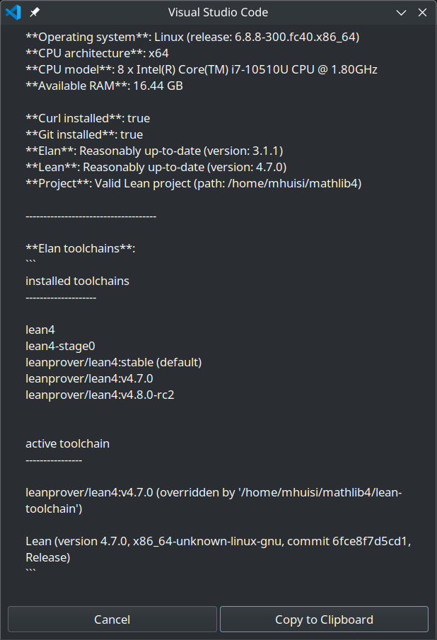 | 
| :--: | 
| *Setup information output* |

### Output view

When Lean produces errors while interacting with a file or when an external command is executed, these errors and all external command output are displayed in the 'Lean: Editor' output view, which can be helpful to diagnose issues. It can be opened using the ['Troubleshooting: Show Output'](command:lean4.troubleshooting.showOutput) command from the [command palette](#command-palette) or the [command menu](#command-menu).

<br/>

| 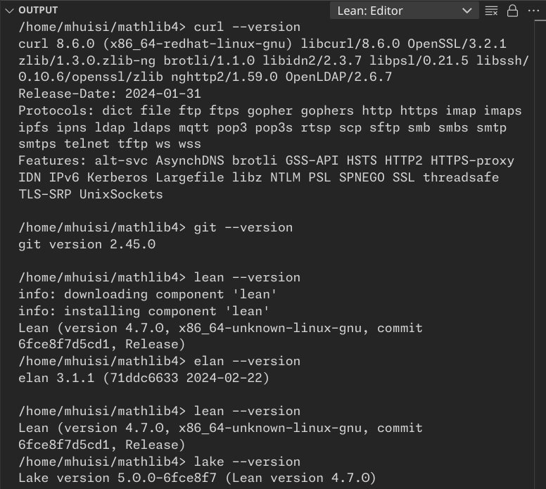 | 
| :--: | 
| *'Lean: Editor' output view* |

### Restarting Lean

When an issue occurs while interacting with Lean and it seems like interacting with Lean is seriously broken, e.g. because a bug occured in Lean, it can always be fully restarted by using the ['Server: Restart Server'](command:lean4.restartServer) command from the [command palette](#command-palette) or the [command menu](#command-menu). If a bug with the Lean 4 VS Code extension occurs instead, then restarting VS Code may help.
