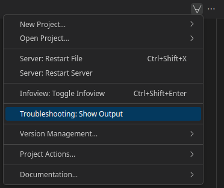

## Collecting VS Code Output
If you are encountering an issue with this VS Code extension, copying the output from the 'Lean: Editor' output panel can be helpful for others who are trying to help you. 
You can open the 'Lean: Editor' output panel by clicking on the ∀-symbol in the top right and selecting 'Troubleshooting: Show Output'.

  

## Asking Questions on the Lean Zulip Chat

To post a question on the [Lean Zulip chat](https://leanprover.zulipchat.com/), you can follow these steps:
1. [Create a new Lean Zulip chat account](https://leanprover.zulipchat.com/register/).
2. [Visit the #new-members stream](https://leanprover.zulipchat.com/#narrow/stream/113489-new-members).
3. Click the 'New topic' button at the bottom of the page, enter a topic title, describe your question or issue in the message text box and click 'Send'.

When posting code on the Lean Zulip chat, please reduce the code to a [minimal working example](https://leanprover-community.github.io/mwe.html) that includes all imports and declarations needed for others to copy and paste the code into their own development environment. Please also make sure to delimit the code by [three backticks](https://github.com/leanprover-community/mathlib/wiki/Code-in-backticks) so that the code is highlighted and formatted correctly.
