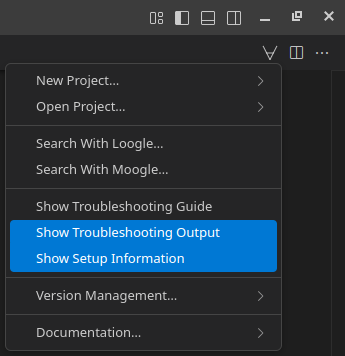

## Antivirus Software
Some users have reported that overly aggressive antivirus software will interfere with all secure network connections in certain Lean commands, leading to errors like the following:
```
curl: (35) schannel: next InitializeSecurityContext failed: Unknown error (0x80092012) - The revocation function was unable to check revocation for the certificate
```
If you encounter this issue, you can try disabling your antivirus, re-run the command that failed and re-enable it afterwards. If you are uncomfortable with disabling your antivirus software altogether, you can also try disabling the specific antivirus feature that is typically causing these issues, commonly known as 'encrypted connection scanning' or 'HTTPS scanning'. You can disable HTTPS scanning as follows in certain common antivirus software: [Kaspersky](https://support.kaspersky.com/KESWin/11.6.0/en-US/175124.htm), [AVG](https://support.avg.com/SupportArticleView?l=en&urlName=Use-AVG-Antivirus-HTTPS-scan&supportType=home), [Avast](https://support.avast.com/en-us/article/use-antivirus-https-scan/#pc).

## Collecting VS Code Output
If you are encountering an issue with Lean or this VS Code extension, copying the output from the 'Troubleshooting: Show Setup Information' and 'Troubleshooting: Show Output' commands can be helpful for others who are trying to help you. 
You can run these commands by clicking on the ∀-symbol in the top right and selecting 'Troubleshooting: Show Setup Information' and 'Troubleshooting: Show Output'.

  

## Asking Questions on the Lean Zulip Chat

To post a question on the [Lean Zulip chat](https://leanprover.zulipchat.com/), you can follow these steps:
1. [Create a new Lean Zulip chat account](https://leanprover.zulipchat.com/register/).
2. [Visit the #new-members stream](https://leanprover.zulipchat.com/#narrow/stream/113489-new-members).
3. Click the 'New topic' button at the bottom of the page, enter a topic title, describe your question or issue in the message text box and click 'Send'.

When posting code on the Lean Zulip chat, please reduce the code to a [minimal working example](https://leanprover-community.github.io/mwe.html) that includes all imports and declarations needed for others to copy and paste the code into their own development environment. Please also make sure to delimit the code by [three backticks](https://github.com/leanprover-community/mathlib/wiki/Code-in-backticks) so that the code is highlighted and formatted correctly.
