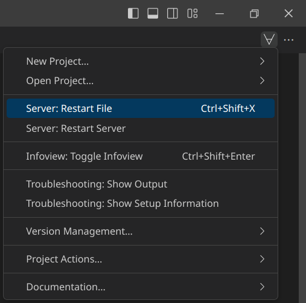
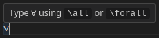
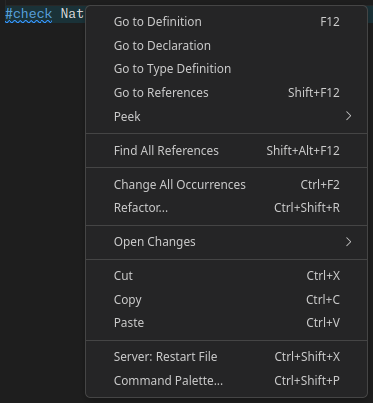
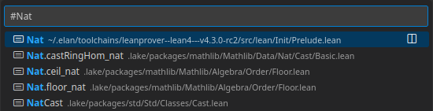

## Using Lean 4 in VS Code

**Working with multiple files**  
When working on a Lean 4 file `A.lean` that imports another Lean 4 file `B.lean`, you will notice that changes to `B.lean` do not automatically appear in `A.lean`.
To make them appear, select the tab for `A.lean`, click on the ∀-symbol in the top right and select 'Server: Restart File' (Ctrl+Shift+X).
This manual interaction helps to prevent accidental and potentially expensive rebuilds of the project.

  

**Inputting Unicode Symbols**  
You can input Unicode symbols in Lean 4 files by typing a backslash (`\`) character followed by the name of the Unicode symbol.
For example, `\all` becomes `∀` and `\Nat` becomes `ℕ`.

If you encounter a Unicode symbol in Lean 4 code and want to learn how to type it, you can hover over the symbol with your mouse and it will display the name of the Unicode symbol.

  

A full list of all Unicode symbol names can be found by clicking on the ∀-symbol in the top right and selecting 'Documentation…' > 'Docview: Show All Abbreviations'.

**Navigating Lean 4 Code**  
Right-clicking on any identifer will bring up the following context menu:

  

The two most important entries in this list are 'Go to Definition' and 'Find All References'.  
'Go to Definition' will take you to the file that defines the identifier, whereas 'Find All References' will display all locations where the identifier is used.

If you know the name of an identifier but are not sure where to find it, you can open the symbol search by hitting 'Ctrl+P' and typing in `#` followed by the name of the identifier. The search will bring up all identifiers containing the given name and clicking on any of the results will take you to the file where it is defined.

  
