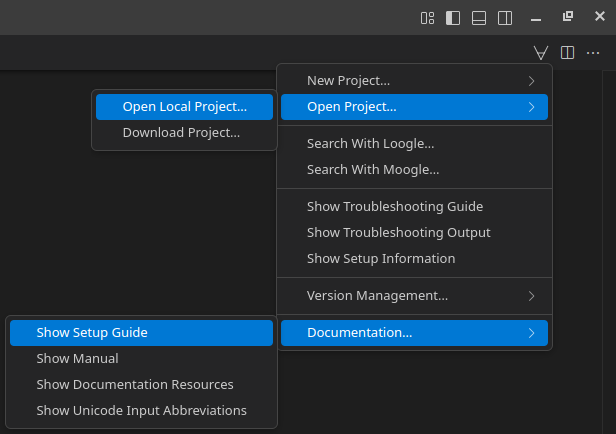

## Creating a Project
Below, you will find links that create new projects or download projects for you. After creating or downloading a project, you can re-open the project in the future by clicking the ∀-symbol in the top right, choosing 'Open Project…' > 'Open Local Project…' and selecting the project you created. If possible, you should avoid creating projects on network drives or in directories indexed by cloud storage, e.g. OneDrive.
Completing the project creation process and choosing to open the new project will close this guide. You can re-open it later by clicking the ∀-symbol in the top right and selecting 'Documentation…' > 'Show Setup Guide'.

  

If you want to create a new project, click on one of the following:
- [Create a new standalone project](command:lean4.project.createStandaloneProject)  
  Standalone projects do not depend on any other Lean 4 projects. This option is suitable if you want to use Lean 4 as a general-purpose programming language or for program verification.  
  Dependencies can be added by modifying 'lakefile.lean' in the newly created project as described [here](https://github.com/leanprover/lean4/blob/master/src/lake/README.md#adding-dependencies). You may want to add [Lean's standard library](https://github.com/leanprover/std4) to the list of dependencies.
- [Create a new project using Mathlib](command:lean4.project.createMathlibProject)  
  The created project will depend on [Mathlib](https://github.com/leanprover-community/mathlib4), the math library of Lean 4. This option is suitable if you want to use Lean 4 for a math formalization project.  
  To update Mathlib after creating the project, you can click the ∀-symbol in the top right and choose 'Project Actions…' > 'Update Dependency…'.

If you want to open an existing project, click on one of the following:
- [Download an existing project](command:lean4.project.clone)  
  This option is suitable if you want to contribute to another Lean 4 project, like [Mathlib](https://github.com/leanprover-community/mathlib4).
- [Open an existing local project](command:lean4.project.open)  
  This option is suitable if you have been provided with a local Lean 4 project by someone else, like an instructor.

## Complex Project Setups
Using its build system and package manager Lake, Lean 4 supports more complex project setups than the ones described above. You can find out more about Lake in the [Lean 4 GitHub repository](https://github.com/leanprover/lean4/blob/master/src/lake/README.md).
