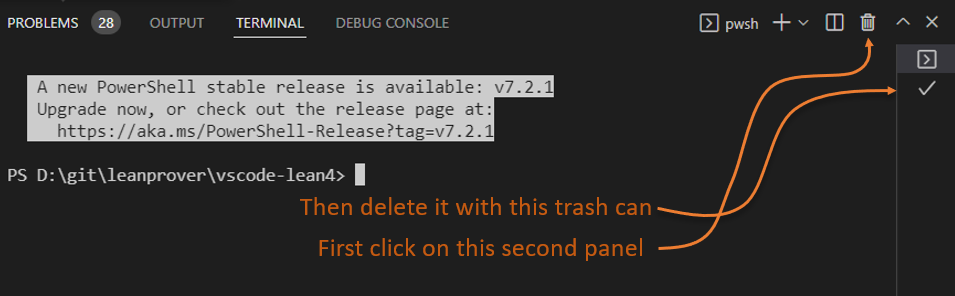

# VS Code Lean Tests

This is the beginning of some integration tests for the VS Code Lean 4 extension.

## Running the tests

To run the tests you must first follow the build steps in [../readme.md](../readme.md).

Now you can run the following from a terminal window inside this `test` folder:
- Run `npm run test` and you will get some handy console output of the test run.

The first time you run the test this way it will download a test version of vscode
and place it in a temporary folder `.vscode-test/`.

## Debugging the tests

- Run the `Debug Tests` target in the Debug View. This will use the `watchTest` build task to:
	- Run `tsc -p . --outDir out` to ensure test code is up to date
	- Start a `npm watch` task to compile the vscode-lean4 extension and watch for changes.
	- Run the extension integration test in a new VS Code window so you can debug the tests.

You will be able to set breakpoints in everything except the `runtests.ts` file which is
a kind of [@vscode/test-electron](https://github.com/microsoft/vscode-test) bootstrapping program.

While these tests can use most VS Code API's to send commands, find windows, edit text,
the tests cannot "close a folder" or "the workspace" or do "developer: reload window" because
those operations will cause an infinite loop as the test itself gets reloaded and runs again.

Note that if you change the test code you have to kill the `watch` process running in the Terminal
window before pressing F5 so that the `tsc -p . --outDir out` steps runs again as shown below:

